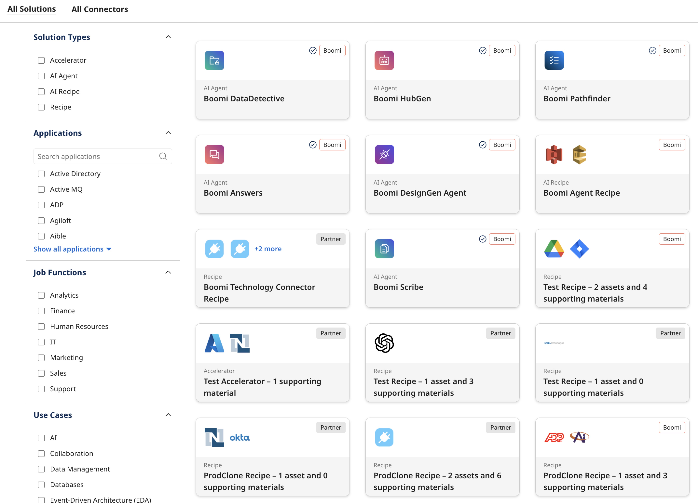

# Boomi Discover

<head>
  <meta name="guidename" content="Platform"/>
  <meta name="context" content="GUID-3133d723-2fff-42d1-815b-4824324fe92f"/>
</head>

Boomi [Discover](https://discover.boomi.com/) offers a new way to fully leverage the capabilities of the Boomi Enterprise Platform through a comprehensive collection of pre-built solution templates. These templates integrate smoothly into your existing Boomi environment, enabling quick and efficient deployment. The Discover catalog showcases various Boomi and Partner Recipes, Accelerators, and AI Agents, all designed for easy installation in your Boomi account that enhance your integration and automation efforts with ease.

As an essential resource, Boomi Discover is invaluable for new users seeking to explore Boomi's capabilities. It gives experienced developers a swift starting point for integration projects and acts as a reference for best practices in design and implementation.

Currently, Boomi Discover features hundreds of unique solutions that are continuously updated to include the latest integrations. These solutions range from fully built end-to-end integrations enabling bidirectional data movement with popular endpoints such as Slack, NetSuite, Shopify, and Salesforce to detailed examples for connecting applications like Google Drive, Snowflake, Amazon SQS, and more. Additionally, many solutions come with supplementary materials, including documentation, videos, and resources, to further enhance the overall user experience.

