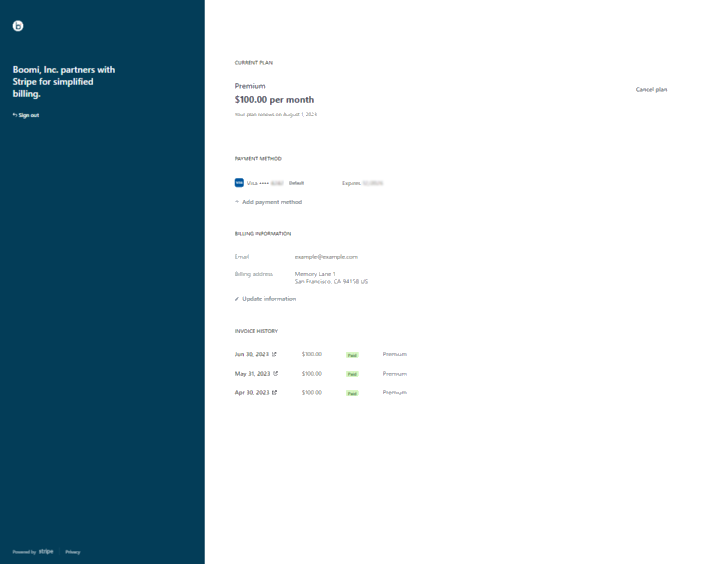

# Boomi Pay-As-You-Go account management

<head>
  <meta name="guidename" content="Platform"/>
  <meta name="context" content="GUID-949dd1ef-72d5-4d18-bc8a-3c5dfcfe0850"/>
</head>

Boomi has partnered with Stripe to assist with payment processing and account management for Boomi Pay-As-You-Go customers.

After you sign up for Boomi Pay-As-You-Go, you receive a welcome email that includes a link to access the [Stripe self-service portal](https://billing.stripe.com/p/login/aEU6s02oi0Gw7IIcMM). Enter the email address that you used to sign up to Pay-As-You-Go and click **Send**.

You will receive an additional email from Boomi, LP with the subject "Your Boomi, LP customer portal login link." Click **Log in** to access your Stripe portal account.

Within the stripe portal, you can perform the following actions:

- See upcoming and outstanding charges
- Update your preferred payment method
- Update your billing information
- Review invoice history \(Draft, Paid, and Past Due\)

    :::note
    
    Your invoice will be emailed to you and also posted in the portal 10 days prior to the charges being finalized.

    :::

- Cancel your subscription

For additional information and if you have any questions about pricing, billing, or payemnt, contact Boomi Pay-As-You-Go Support at [payasyougo@boomi.com](mailto:payasyougo@boomi.com).
