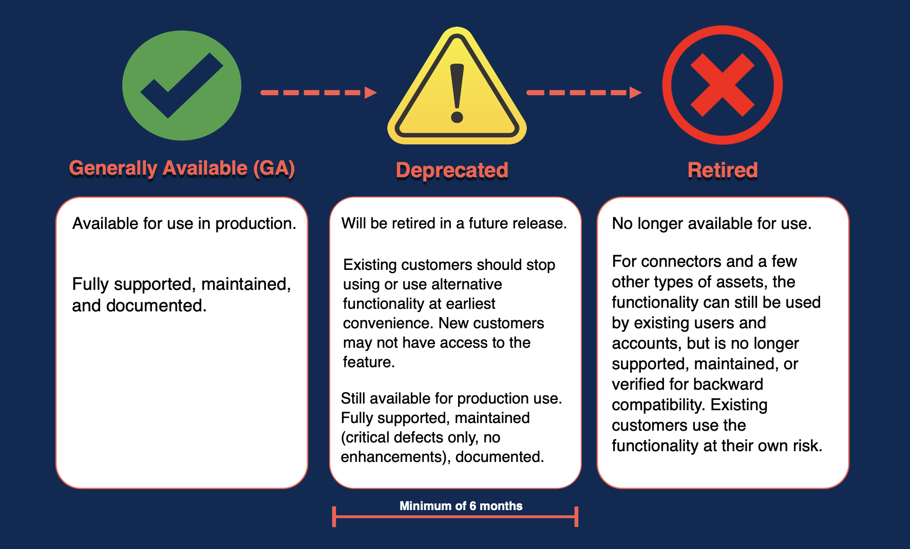

# Boomi feature deprecation process and policy

<head>
  <meta name="guidename" content="Platform"/>
  <meta name="context" content="GUID-e4547744-664f-4539-bd23-b91676bcbd8a"/>
</head>

Read about Boomi's processes and policies for deprecating and retiring features and connectors from the Boomi Enterprise Platform.

Deprecation is an inevitable part of the product lifecycle that sometimes requires replacing outdated functionality with new features that better meet your needs. Earning and keeping your trust is critical, and Boomi wants to respect that through advanced and transparent communications. Boomi understands the impact of change on your organization, so feature retirement is not taken lightly.

Note that Boomi’s deprecation process and policy applies to both features and connectors but in some instances, deprecation and retirement of connectors may have different impacts. Where applicable, the differences between deprecation of features and deprecation of connectors are described herein.

See [Boomi Product & Feature Retirements](https://community.boomi.com/s/deprecated-features) for the current list of planned retirements.

## Key concepts

**Deprecation** 

When a feature is deprecated, it is nearing the end of its support and is planned to be retired from the Boomi Enterprise Platform at some point in the future. While deprecated, the feature remains functional and supported until its retirement date, however enhancement requests are not prioritized and are typically targeted for the replacement functionality. Features generally remain deprecated for a minimum of six months prior to retirement, except for in special cases as described below.
New customers and accounts might not receive access to deprecated features. Existing customers have continued access until the final retirement date but should begin planning to accommodate the change.

:::note

Any versions, features, or functionality of the products or services labeled "Early Access" or "Technology Preview" are excluded from this Deprecation Policy and might retire without notice.

:::

**Retirement**

When a feature is retired at the end of the deprecation stage, it is no longer supported on the Boomi Enterprise Platform. The availability and behavior of a retired feature might differ based on its nature.

Some common examples:

- User interface and platform or control plane functionality might be removed entirely and simply be no longer available. Existing customer accounts might be automatically migrated to or behavior defaulted to use the new functionality instead if applicable. If Boomi provides alternative functionality to replace the retired component, users can leverage the feature at their convenience before the retirement date.

- Retired connectors will not be removed from your account, and deployed processes using those connectors will continue to run. However, retired connectors are no longer maintained or supported. Without a guarantee of backward compatibility, customers use them at their own risk. Boomi strongly recommends avoiding the use of retired connectors.

- Platform APIs return a terminal status indicating they are no longer available.

For more information around support levels and feature stages, see the topic [Feature release stages](atm-Feature_release_stages_00d83b66-e5db-4038-8398-fcaead4be12d.md).

## Why does Boomi deprecate features?

Innovation is at the center of everything we do at Boomi. With ongoing improvements to the Boomi Enterprise Platform, sometimes that means retiring outdated functionality or features that provide low value to a limited number of customers.

There are several motivations for why we deprecate features:

- Boomi's Product and Engineering team continuously investigates and implements better ways of doing things. With a focus on innovation and our customers' evolving needs, some technologies and applications on our platform might no longer serve customers in the most effective way possible. 

- Third-party software leveraged by the Boomi Enterprise Platform might no longer support specific functionality.

- Boomi strictly adheres to industry standards for security and legal compliance. As a result, Boomi might be required to deprecate or retire functionality that does not meet these standards.

## What is Boomi's deprecation philosophy?

Boomi deprecates features only when absolutely necessary. Usually, Boomi upgrades features to provide enhanced functionality. However, it is sometimes necessary to deprecate and retire a feature altogether. In such events, Boomi works to provide as much advance notice as possible so that you can adequately prepare for any changes to your account.

In addition to early communication, Boomi offers transition support to help customers adopt newer functionality or perform as normal after an outdated feature is deprecated from the platform. To minimize customer impact, deprecation and retirement dates typically align with our product release schedule. Visit [https://stats.boomi.com/notifications/](https://stats.boomi.com/notifications/) for more information about Boomi's upcoming Platform release schedule.

## How much advance notice will I receive?

Barring any emergencies or very minor changes, we start communicating feature deprecation at least six (6) months before its retirement date. Advance notice might be extended for higher-impact features.

However there are situations in which the deprecation timeline can accelerate due to special circumstances. In all cases, we provide as much advance notification as possible. These situations include:

- Essential changes, such as those needed to maintain the integrity and stability of the platform for all customers.

- When third-party software leveraged by Boomi changes or is no longer available (see note below).

- To protect data security and comply with legal requirements.

:::note

Boomi sometimes utilizes third parties who might change their websites, clouds, and code anytime. Because these companies have their own release and communication schedules, Boomi cannot guarantee advance notice of any related feature or connection changes as a result of third-party changes.

:::

## How does Boomi communicate feature deprecation?

Boomi communicates feature deprecation and announcements to account administrators through various channels to ensure the message goes to impacted customers as early as possible. Communication channels can include (but are not limited to) release notes, in-application platform messaging, Community announcements, blogs or knowledge articles, Training notices, and Customer Success messaging such as email, phone, or periodic health checks as appropriate. For the Boomi Enterprise Platform APIs, HTTP status codes and headers return deprecation information in the response.
