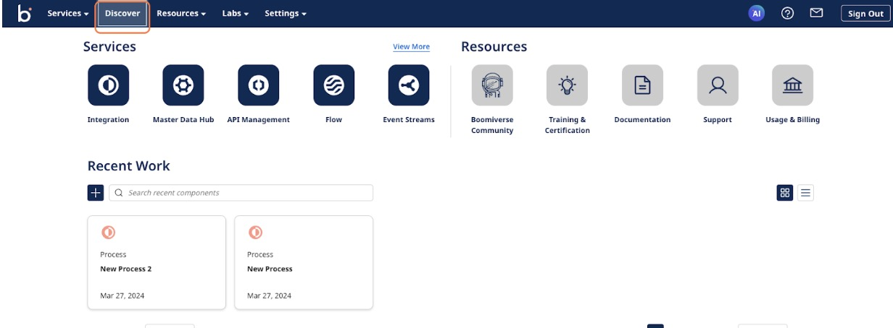

# Getting Started with Discover

<head>
  <meta name="guidename" content="Platform"/>
  <meta name="context" content="GUID-736401cd-bb36-42f8-99b7-d40dd1c0b30c"/>
</head>

## Prerequisites​

To perform any actions on Discover, you must have a valid Boomi account. If you do not have an account, visit [discover.boomi.com/sign-up](https://discover.boomi.com/sign-up) to complete the registration process and unlock the full features.

## Accessing Discover

Log into the [Boomi Enterprise Platform](https://platform.boomi.com/#login), select Discover from the primary navigation menu, or navigate directly using the Discover [link](https://discover.boomi.com/). 

 

 After logging in, you can effortlessly browse and install solutions, initiating your Boomi journey with access to pre-built templates, including Recipes, Accelerators, and Agents.
## Key Terms

- **Recipes**: Free, installable templates that encompass integration and flow assets.

- **Accelerators**: Comprehensive services, including personalized support from professional services for implementing Boomi solutions.

- **AI Agents**: Software entities created with defined goals and characteristics, enabling automation and execution of specific tasks autonomously or with minimal human input.

## Discover Functionalities

- **Search and filter**: This feature helps you navigate the solution catalog effectively.

- **Install Recipe**: Easily install Recipes using the Discover user interface.

- **View Accelerators**: You can view the accelerators posted to Discover and contact the Solution team if they need to install an accelerator solution.

- **Pre-installed AI Agents**: Utilize the six pre-installed Boomi AI Agents on the platform without manual installation.

:::note

Only approved partners and authorized users can create and delete solutions to and from the Discover catalog. However, all users can install and copy available solutions.

:::
