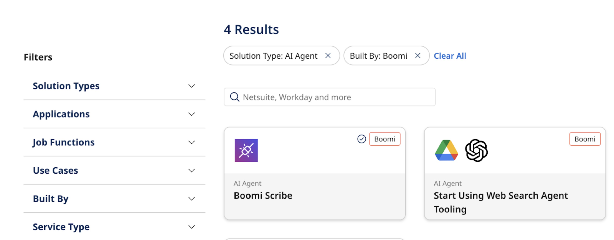
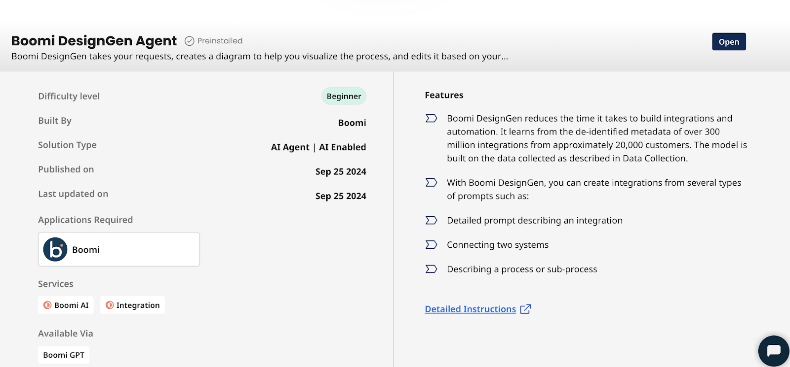
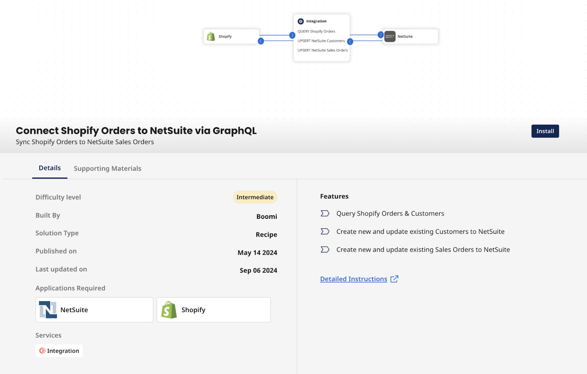
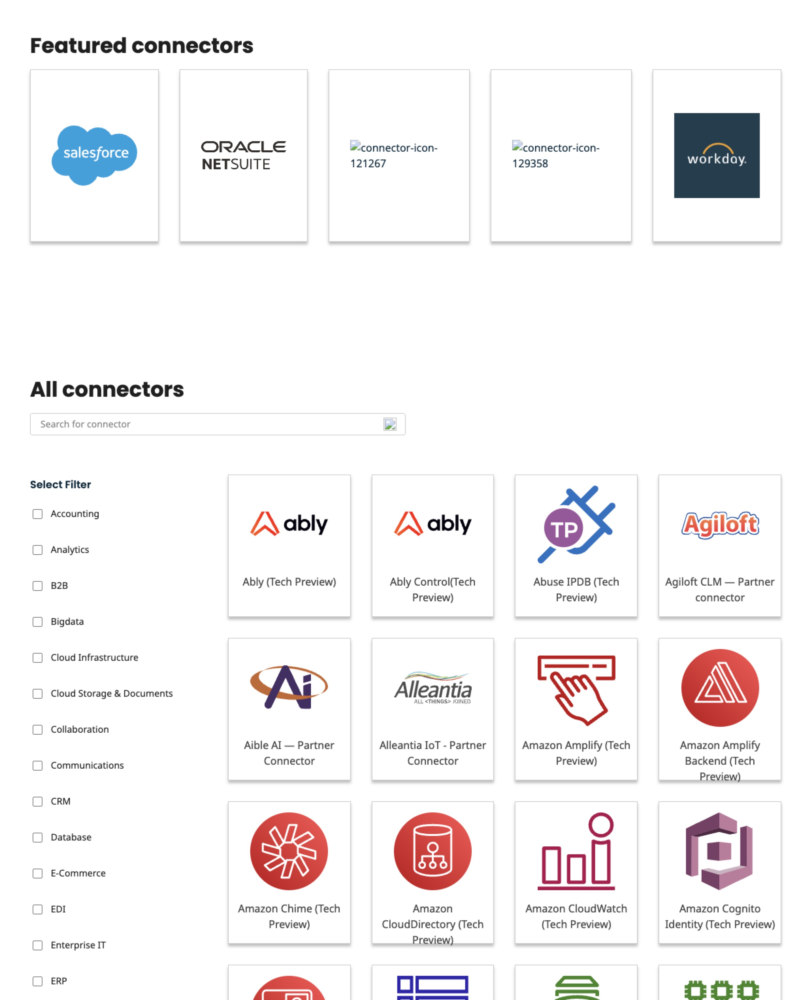

# Discover User Interface

<head>
  <meta name="guidename" content="Platform"/>
  <meta name="context" content="GUID-c9940717-5ee8-4726-b970-dcd011570d0f"/>
</head>

## Home page

The **Popular Solutions** section highlights the most sought-after integration and automation tools available on Discover. This feature allows you to quickly identify and access widely recognized solutions for their effectiveness in addressing various business challenges. 

The **Latest AI Solutions** section showcases the newly added AI capabilities available on Discover. This area helps you explore AI solutions tailored to diverse business needs. These offerings leverage AI-powered functionalities to enhance your integration and automation initiatives, driving greater efficiency and effectiveness in your processes.

The user interface features a **Get Started with Boomi AI** banner that offers quick access to six Boomi AI Agents. You can navigate directly to the details of these offerings with a single click. These AI Agents helps to automate routine tasks, optimize decision-making, enhance customer service, and streamline business processes, enabling organizations to operate more efficiently and effectively. Read [Boomi AI Agents](https://help.boomi.com/docs/Atomsphere/Platform/atm-BoomiAI_Agent_Garden#boomi-ai-agents) to learn more. 

## All Solutions page

### Search and filter

The page facilitates searching and filtering solutions, making it easier for you to navigate through solutions. You can choose and install solutions that enable to connect, integrate, and automate workflows easily. These solutions tailor to user needs and highlight their functionalities and benefits.

You can explore the catalog by browsing categories or using the search functionality to locate specific Recipes, Agents, and Accelerators. Filter options include: 

  - Solution Types
  - Applications 
  - Job Functions
  - Use Cases
  - Built By 
  - Service Type

    

The **Details** tab of the selected solution displays the asset descriptions. Asset descriptions include any or all of the following depending on the information uploaded for the chosen solution:

  - Asset Details - Comprehensive details about the featured solution.
  - Supporting Materials - Support documents providing additional information related to the solution. 
  - How it works video - Video showcasing the solution.
  - Features - Key characteristics of the solution.
  - Detailed instructions - Articles associated with the solution's functionality. 
  - Available via- Methods through which you can access and utilize the AI Agents through different methods, such as the Boomi GPT, API calls, and the Integration Canvas.  

    

### Install

Select the **Install** button to install the solution directly into your Boomi Enterprise Platform account. After installation, you are redirected to your platform account, and the Recipe will open in your Integration canvas, allowing for necessary edits and customizations. 

You can find Boomi AI Agents as preinstalled assets on Discover, eliminating the need for manual installation. Authenticated users can access the agents by clicking the **Open** button, while non-authenticated users can use the **Try It** button. These agents are marked as pre-installed on the page.

## All Connectors page

The **All Connectors** page on Boomi Discover is a comprehensive catalog of integration connectors that facilitate seamless connectivity between various applications, data sources, and platforms. You can explore various pre-built connectors designed to streamline workflows, enhance data exchange, and optimize business processes across environments.

 

## Support

If you have any inquiries regarding the catalog or suggestions for new recipes, reach out using the [contact link](https://discover.boomi.com/contact-us) in the Discover UI. The Boomi team is ready to assist you and ensure a smooth experience with Boomi Discover.
x