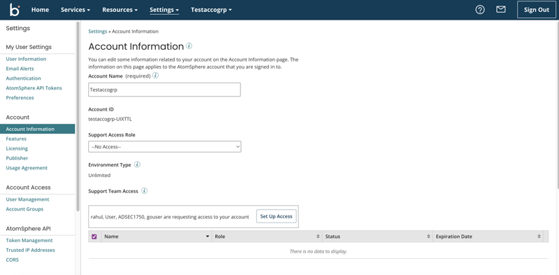
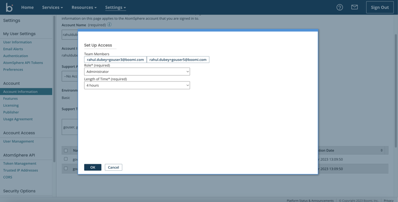

# Granting temporary account access to Boomi support users

<head>
  <meta name="guidename" content="Platform"/>
  <meta name="context" content="GUID-31b51d1a-73c3-43c9-903c-7c1001b99c72"/>
</head>

You can grant temporary account access to Boomi support users by using Temporary Elevated Access Management in the Boomi Enterprise Platform.

## About this task

If **Support Access Role** is set to `No access` on the Account Information panel to prevent Boomi support users from accessing your account, you can provide temporary credentials to allow limited access for support.

:::note

You must be an account administrator to use this feature.

:::

1. When a Boomi support team member requests access to your account, the request displays in the **Support Team Access** section of the Account Information panel. Click **Set Up Access** to configure the temporary credentials.

    

2. Choose the access role that you want to grant the support team member and set an expiration date for the credentials to end.

    

    Click **OK** to save the configuration.

    Once you have granted access to a user, you can **Extend** their credentials or **Expire** their access early.
