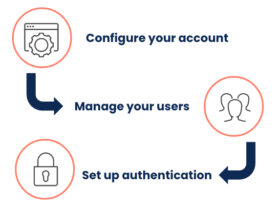
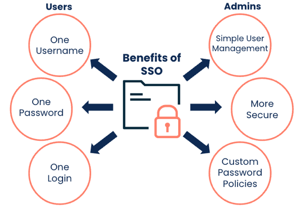

# Jumpstart your journey with Administration

<head>
  <meta name="guidename" content="Platform"/>
  <meta name="context" content="GUID-501ff353-69f2-48a8-91b1-b7680b1cf819 "/>
</head>

As a Boomi Account Administrator, you can perform many tasks to manage your users, such as adding or removing users, assigning roles, and configuring authentication and security features.

## Configure your account

You can configure your account from the My User Settings section of the Settings page:

- [User information](./r-atm-User_information_management_6cb11e71-95a5-4257-aaff-66da5a1517ff.md) - Manage your username, password, email, and time zone
- [Email alerts](./c-atm-_Email_alert_management_88a27564-0062-4cd8-9dfb-2226b122b1da.md) - Set up email alerts for Atom status, process execution status, or user notifications
- [Authentication](./t-atm-Setting_up_two-factor_authentication_a7c41d56-e9a9-4200-96eb-d3308520ab68.md) - Configure two-factor authentication for your account
- [AtomSphere API tokens](./int-AtomSphere_API_Tokens_page_6a75a1f6-709c-4b08-b3bd-85fe2ac02e18.md) - Create and manage API tokens to authenticate to Boomi APIs without using your username and password
- [Preferences](./atm-Preferences_8755af68-ec6f-4f6d-8c03-416e654cf479.md) - Specify preferences for your account, such as your customized landing page or turning on beta features

## Manage your users

You can add users on the [User Management](./r-atm-User_management_baf961e2-b480-4fca-a3f5-8262aed6c031.md) page. Then, you can assign roles to your users that control their access to the Boomi Enterprise Platform.

- [Adding a user and assigning roles](./t-atm-Adding_a_user_and_assigning_roles_d68063f7-2dea-4271-8c0c-6084c4c2226f.md)
- [Editing a user’s roles](./t-atm-Editing_a_users_roles_3889df0e-aa10-4cb3-9357-070eebac7de0.md)
- [Removing a user](./t-atm-Removing_a_user_466d45b5-0605-4296-9ce0-b4f3e1b6d89f.md)

### Roles and privileges

Boomi offers many [user roles](./c-atm-User_roles_and_privileges_5a1c8a1a-4d58-4e7d-a6b6-b684a0c6d672.md), but you can create [custom roles](./t-atm-Adding_a_custom_role_de2bd23b-ce3a-4db3-9656-cacab756e76e.md) if you need more control over user access.

:::note

Custom roles are an Advanced User Security feature included in the Enterprise and Enterprise Plus Editions and available as an add-on to the Professional and Professional Plus Editions.

:::

<iframe width="600px" height="400px" src="https://embed.app.guidde.com/playbooks/di4d5uMTE5GxoawWw4sGA9" title="Creating a custom role for user accounts" frameborder="0" referrerpolicy="unsafe-url" allowfullscreen="true" allow="clipboard-write" sandbox="allow-popups allow-popups-to-escape-sandbox allow-scripts allow-forms allow-same-origin allow-presentation"></iframe>

### Account groups

Using [Account Groups](./c-atm-Account_group_management_3997faa4-569c-4092-83ff-b0ff9a3ce161.md) can simplify user management. You can [add users to an account group](./t-atm-Adding_an_account_group_35c1fa9e-473d-4d9e-a50f-057d9b55112d.md) and assign roles and privileges to the entire group. Contact Boomi to add account groups to your administrator account.

### Features

You can configure certain [features](./int-Account_features_page_2f7d9196-e800-4f11-8cf9-9a2a3f06549c.md) for your account, including Advanced Environment access, Data Collection, RSS Feeds, and API metrics and dashboards. Adding Advanced Environment Access to a user account provides two additional privileges you can add to a custom role.

## Set up authentication and security

Boomi has a unified login across products, allowing you to use a single set of credentials to access any Boomi service. You can learn more in [Understanding Unified Login](./atm-Understanding_unified_login.md).

:::note

Only FedRAMP and SAML SSO account administrators can set custom password requirements for their users.

:::

You can configure the following settings for user accounts from the Security panel:

- [Sessions](./c-atm-Session_Security_3e5eb0f0-5606-46c4-a63a-40d3ecc5ec67.md) - Set limitations for inactive sessions and the number of concurrent sessions for each user
- [Two-factor authentication](./t-atm-Setting_up_two-factor_authentication_a7c41d56-e9a9-4200-96eb-d3308520ab68.md) - Require all user accounts to set up two-factor authentication
- [Trusted IP addresses](./int_trusted_ip_addresses_management_38edd736-b192-4196-be4b-d73088731e91.md) - Specify trusted IP addresses that can make API calls
- [API Token management](./int-Tokens_Management_page_32da8ba5-1209-45ae-81a4-5a0ae8bb6392.md) - View and manage all API tokens generated by user accounts

### Single sign-on

You can set up [single sign-on](./c-atm-Single_sign-on_with_SAML_authentication_71c031d5-5912-4255-bb8e-61a129afabc1.md) (SSO) for your users on the Boomi Enterprise platform, which allows them to sign in once and access all authorized applications.

:::note

Single sign-on is an Advanced User Security feature included in the Enterprise and Enterprise Plus Editions and available as an add-on to the Professional and Professional Plus Editions.

:::

- [Enable SSO for users](./c-atm-Implementing_single_sign-on_with_SAML_5768043c-5c27-4e3a-b099-37c50f543de3.md)
- [Customize password policies](./c-atm-Password_Management_a30d9107-34c9-429a-b12e-c5821ce1df8b.mdb)
- [Manage single sign-on users](./c-atm-Single_sign-on_users_120518a2-20d8-48df-aaa1-a9b53b8b3e99.md)
