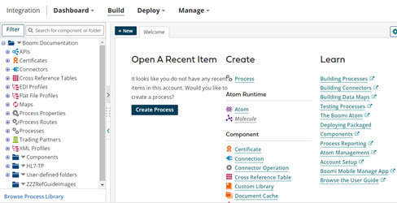
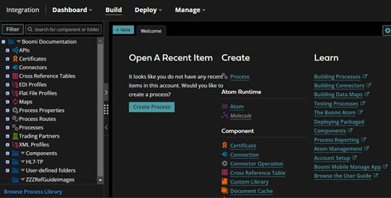

# User Preferences

<head>
  <meta name="guidename" content="Platform"/>
  <meta name="context" content="GUID-8755AF68-EC6F-4F6D-8C03-416E654CF479"/>
</head>

You can specify preferences for your user account, such as your customized landing page or turning on beta features, in the Preferences panel of the Settings page.

The information on the **Preferences** panel in the Settings page applies to the user signed in to the Boomi Enterprise Platform. You can change all of the user information displayed on this panel. You must sign in as an alternate user to configure that user's information. You must refresh the page after any option changes before they take effect in the user interface.

## Integration

There are several Integration preferences that you can set:

- **Automatically restore your previously opened components**
    
    For convenience, any processes or components that you previously had open upon exiting the Build page are automatically restored upon your next visit to the Build page. This feature lets you quickly access components and processes that you did not intentionally close (for example, if you accidentally close your browser while working or switch to a different ​Boomi application).

    :::note
    
    This feature does not serve as an automatic save feature. Components and processes open to their last saved state.

    :::

    This feature is turned on by default. If you wish to disable the Build page from restoring open components and processes, turn off this toggle.

- **Use getting started screen for connector operations**

    When creating a new SDK connector operation that supports browse, a Getting Started screen appears to jump start the import operations process. This feature is turned on by default. If you wish to disable the Getting Started screen for new connector operations, turn off this toggle.

- **Select your theme**

    Change the color scheme between light and dark theme for your Integration, API Management, and Boomi DataHub workspaces. You can switch between dark and light-colored text, icons, and graphical user interface elements on a light or dark background.

    |||

- **Enable Localization**

    This feature is turned off by default. Turn the feature on to enable localization of the browser. You can select the locale preference from the drop-down menu. 

## Beta Features

Try out pre-release features in the Boomi Enterprise Platform:

- **Preview the API Explorer \(GraphQL Only\)**

    The API Explorer is a built-in developer tool that you can use to test and explore GraphQL APIs. Currently this feature only supports Metrics APIs, but additional functionality will be added in future releases. After enabling this beta feature, you can launch API Explorer by selecting Resources > API Explorer from the Boomi Enterprise Platform menu bar. For more information, see the topic [GraphQL API Management APIs](../API%20Management/Topics/api-GraphQL_API_Management_APIs_18f1a55a-b3d7-4b9e-ab0a-162fc4a67686.md).

- **Customized Landing Page**

    Specify a customized location within the platform to land upon signing in to Boomi Enterprise Platform. You can select the Home page or any menu page within Integration, Boomi DataHub, or API Management.

    Once this page is selected, you land on your specified page instead of the Platform home page. However, if you sign in to a bookmarked page that is different from the home page, you continue to land on your bookmarked page

    :::info

    You can select any possible landing page, even if your account does not have access to that page. If you select a page that you do not have access to as your landing page, you land on the default landing page for the specified Service.

    :::

To revert these beta features, simply toggle these options off in your user Preferences page.
