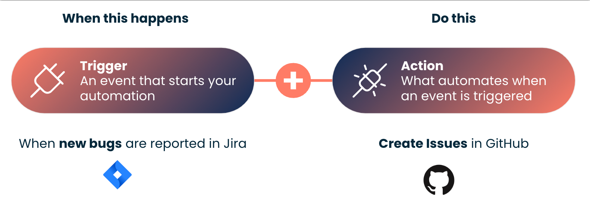

# Task Automation (Tech Preview)

<head>
  <meta name="guidename" content="Platform"/>
  <meta name="context" content="GUID-707dc533-46db-4a54-a7de-55ebdcf9dc97"/>
</head>

## Overview

Boomi Task Automation is a simple to use application that allows you to automate your everyday manual tasks and key business processes without using any code. It is fast, simple, and intuitive where you set up a trigger and an action and then Task Automation automatically runs the process as per the trigger you set. It saves you time, effort, increases productivity, and speeds up the execution of business objectives. For example, you may want to automate the process that every time your team's inbox receives an email (trigger), a notification is sent to your team's slack channel (action).

Task Automation simplifies the process of connecting and automating by offering improved functionality, process building, triggering, dashboard monitoring, and analytics. The user-friendly interface makes it easy to create multi-step automations and streamline business processes. You can monitor and control your automated processes from a single dashboard. You eliminate manual time-consuming procedures and focus on more strategic and value-added tasks.

Task Automation gives you access to a wide range of supported applications that are often used in business process automation. We're continuously adding new supported applications.

## How does a task work?

 