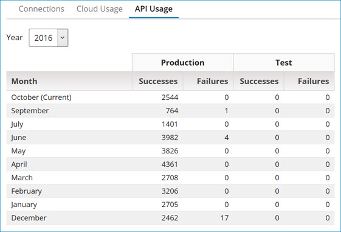

# API Usage tab 

<head>
  <meta name="guidename" content="Platform"/>
  <meta name="context" content="GUID-49e6a2e4-90c8-44ae-8a2b-d151913367b9"/>
</head>

The **API Usage** tab in **Licensing** shows your account's total number of API calls.

For each year, you can view the usage by month.

