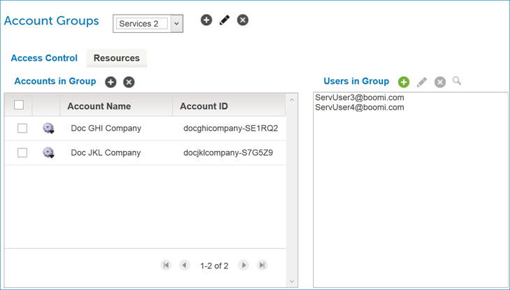
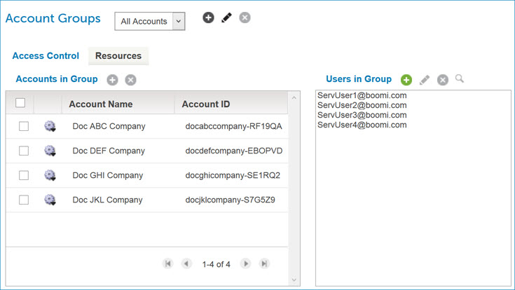

# Account groups example 

<head>
  <meta name="guidename" content="Platform"/>
  <meta name="context" content="GUID-c2e6b5c2-e830-48db-b7d2-ec5a1becf8d2"/>
</head>

This example shows a Documentation primary account, who is a partner, managing four customer accounts.

The four customer accounts are:

-   Doc ABC Company

-   Doc DEF Company

-   Doc GHI Company

-   Doc JKL Company

The partner has four users that need to share the development and support duties for these customer accounts. The users are:

-   ServUser1@boomi.com

-   ServUser2@boomi.com

-   ServUser3@boomi.com

-   ServUser4@boomi.com

The partner's business scenario is:

-   All four users need to have the Support or Production Support role so that they can effectively troubleshoot and retry deployed processes.

-   The users ServUser1 and ServUser2 need to have the Standard User role so that they can effectively develop and test processes in the Doc ABC Company and Doc DEF Company accounts.

-   The users ServUser3 and ServUser4 need to have Standard User role so that they can effectively develop and test processes in the Doc GHI Company and Doc JKL Company accounts.

Two account groups can be added to handle the different Services teams and to distribute account access.

The users ServUser1 and ServUser2 are added and granted the Standard User role so that they can handle all development and managements tasks for the Doc ABC Company and Doc DEF Company accounts.

The users ServUser3 and ServUser4 are added and granted the Standard User role so that they can handle all development and management tasks for the Doc GHI Company and Doc JKL Company accounts.

In the All Accounts account group, all four users are added with the Support or Production Support role so that each user gets a *union* of the roles and privileges that are distributed across account groups.

