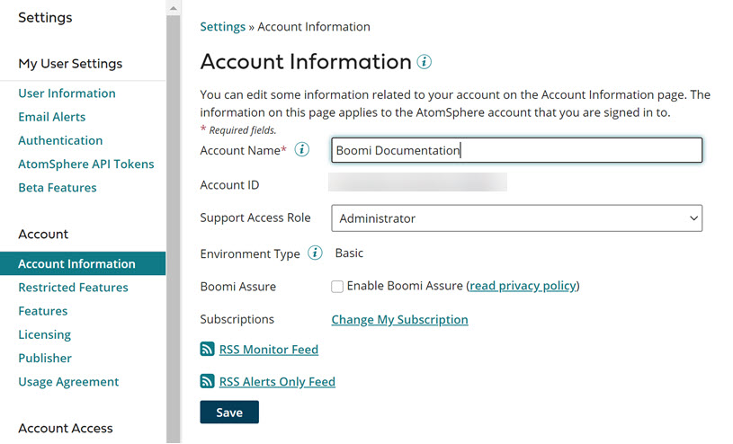

# Accounts and users 

<head>
  <meta name="guidename" content="Platform"/>
  <meta name="context" content="GUID-3107b353-d1f0-42ee-a563-2eeaff653304"/>
</head>

You manage account and user **settings** on the Settings page, which opens when you select **Settings > Account Information and Setup** in the menu bar. The **Settings** page contains a column of tabs on the left side. Each tab, when selected, enables access to settings for the Boomi account you are currently using.

The tabs available to you are dependent on the account type, your role and the platform edition. Administrators need to ensure that users have the proper access privileges to the **Settings** page and its tabs to fully administer their Boomi accounts.

These are the tabs in the **Settings** page:

|Tab|Description|
|---|-----------|
|[User Information](r-atm-User_information_management_6cb11e71-95a5-4257-aaff-66da5a1517ff.md)|Update your user sign-in information.|
|[Email Alerts](c-atm-_Email_alert_management_88a27564-0062-4cd8-9dfb-2226b122b1da.md)|Configure your Atom and process alert email subscriptions.|
|[Authentication](c-atm-Two-factor_authentication_b539d687-2384-4d0c-8f17-75e066e9269a.md)|Configure two-factor authentication for your user ID.|
|[Atomsphere API tokens](/docs/Atomsphere/Platform/int-AtomSphere_API_Tokens_page_6a75a1f6-709c-4b08-b3bd-85fe2ac02e18.md)|Create, disable, enable, or revoke API tokens to use with the AtomSphere API and AtomSphere Partner API.|
|[Account Information](r-atm-Account_information_management_ae14e3ab-37ae-4162-ad6c-9810a81329a4.md)|Configure and review account-level settings and system messages.|
|[Account Features](int-Account_features_page_2f7d9196-e800-4f11-8cf9-9a2a3f06549c.md)|\(For administrators only\) Enable or disable user access to RSS Monitor feeds and RSS Alerts Only feeds.|
|[Licensing](c-atm-License_management_7f3b0031-d80a-49a4-a744-e8878108cd38.md)|Review your account’s connection license usage.|
|[Publisher](/docs/Atomsphere/Integration/Integration%20management/r-atm-Publisher_tab_3285900f-5086-4c31-bcd2-e8a4b4a16ed5.md)|Add and edit account publisher information.|
|[Account usage agreement](r-atm-Account_notification_banner_5218efa2-749d-4f34-ad4e-ac3f7d88f62d.md)|\(For administrators only\) Enable and define account usage agreements that users must acknowledge upon signing in or switching accounts.|
|[Authentication](c-atm-Two-factor_authentication_b539d687-2384-4d0c-8f17-75e066e9269a.md)|Configure two-factor authentication for your account.|
|[User Management](r-atm-User_management_baf961e2-b480-4fca-a3f5-8262aed6c031.md)|Add, edit, and remove user access and privileges for your account.|
|[Account Groups](c-atm-Account_group_management_3997faa4-569c-4092-83ff-b0ff9a3ce161.md)|\(For partners only\) Create and manage account groups to control user access to your customer accounts.|
|[Token Management](int-Tokens_Management_page_32da8ba5-1209-45ae-81a4-5a0ae8bb6392.md)|\(For administrators only\) Manage user API tokens created on an account.|
|[Trusted IP Addresses](int_trusted_ip_addresses_management_38edd736-b192-4196-be4b-d73088731e91.md)|\(For administrators only\) Allow a specified a list of trusted IP addresses to access the API.|
|[CORS](https://developer.boomi.com/api/platformapi#section/Introduction/Account-security-for-CORS)|Configure CORS rules for RESTish requests in the AtomSphere and Partner APIs.|
|[Password Policy](c-atm-Password_Management_a30d9107-34c9-429a-b12e-c5821ce1df8b.md)|Set rules that your account users must follow for setting passwords.|
|[SSO Options](c-atm-Single_sign-on_with_SAML_authentication_71c031d5-5912-4255-bb8e-61a129afabc1.md)|\(For administrators only\) If your account uses single sign-on, enter your information about the identity provider's certificate and sign-in URL, the service provider's \('s\) sign-in URL, and metadata URL.|
|[Security](c-atm-Session_Security_3e5eb0f0-5606-46c4-a63a-40d3ecc5ec67.md)|\(For administrators only\) Set session locks and termination and session concurrency restrictions on user accounts. If the account has the API Access feature, configure CORS request handling rules for RESTish AtomSphere API and Partner API requests. Additionally, require users to configure two-factor authentication before signing in or switching to an account.|
|[Account Libraries](r-atm-Account_Library_Management_edc37905-b4fe-4cae-8001-b62221adb872.md)|Upload and manage custom files for use with your integration processes.|
|[Developer](r-atm-Developer_tab_cd493d85-1fbd-4f6c-b8d1-f7d5c4a51f64.md)|Upload and manage your custom connectors developed with the Connector SDK.|
|[Document Tracking](/docs/Atomsphere/Integration/Integration%20management/c-atm-Document_Tracking_bf2f68f0-a8b1-4efc-8726-424341acaccc.md)|Enable custom tracked fields to monitor inbound and outbound data in **Manage** \> **Process Reporting**.|