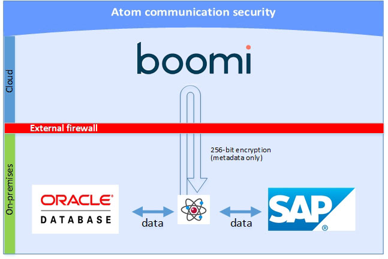

# Atom communication security 

<head>
  <meta name="guidename" content="Platform"/>
  <meta name="context" content="GUID-63f5d42d-614e-4b0a-942d-d8693fd8000b"/>
</head>

We carefully created the Atom architecture with your security in mind. Because the Atom can reside in your network or can be hosted in our data center, provides extensive security measures, both internally and in our data center, to prevent any compromise in your data or the Atom.

During installation, no third-party software is installed with the Atom except in the case noted. The data center verifies and authenticates all installations and downloads before deployment.

After deploying the Atom behind the firewall, the Atom is in continuous contact with the data center for tracking and status information. You do not need to open any inbound firewall ports for the Atom to communicate with the data center because *the Atom initiates all communication* to the data center. The Atom always starts the connection, so the data center never sends data from the data center to the Atom. When the Atom initiates the connection to the data center, it always authenticates it before sending data using an SSL handshake. It uses the digital certificate automatically created during registration \(see Password Encryption Security\).

The communication security protocol:

-    All communication from the Atom to the data center uses TLS version 1.2 encryption.
-    All outbound communication from the to the data center is HTTPS, port 443.

-   The uses a standard TLS handshake to authenticate with `platform.boomi.com`.

The Atom communicates information to  Integration in two modes: ongoing or automatic communications and user-initiated communications. As stated previously, production data is never sent to the data center unless explicitly configured by the Integration user, for example if the Atom is hosted versus downloaded. The Atom does not transport any information to the data center without explicit request by the user.

The following information is transmitted to the data center automatically by the Atom:

-  Online Status — The Atom communicates on an ongoing basis with the data center to indicate its status. This ensures uptime of any deployed Atom, and the Integration service knows in a short time frame if the Atom goes offline for any reason.

-   Tracking Information — File name, directory, and so on of the files processed (if applicable) as well as success and failure counts, process runs, and so on.

-  Integration Process Updates — The Atom periodically checks for and applies any updates to the configuration of the integration processes made by the user.

-   Atom Updates — The Atom periodically checks for and applies any updates to the Atom code itself.

The Atom transmits the following information to the data center upon request by a user:

-   Logging Information — Information about running a specific integration process. The total run time, along with logging for each step in the process, and error messages that pertain to a run failure, if one occurred.

-   Error Details — A detailed error message explaining what the error was that caused a specific run of an integration process to fail.

-   Connector browsing (for specific connectors) — For example, when building processes, it can transmit database schema information to define the field mapping rules. It only sends schema information, and no actual data.