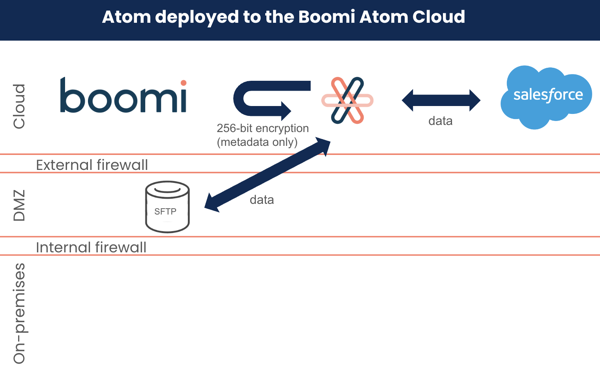

# Data communication security

<head>
  <meta name="guidename" content="Platform"/>
  <meta name="context" content="GUID-b2fbdc16-f1d9-4fbe-b764-256cf9345beb"/>
</head>

The Boomi Enterprise Platform architecture allows for significant data security for both on-premise data and data deployed in the Cloud.

Data that is processed through an on-premise (local) Atom never actually flows through the Boomi data center. Instead, data is stored behind the firewall on the customer server that deployed the Atom. Data is transported directly to either the SaaS or an on-premise application through a connector configured to the specific security requirements of the user. Only **tracked** or **status** data is sent to the data center when the user initiates a request from the data center to the Atom. This information includes but is not limited to file size, file name, and status information.

For Atoms deployed to our Boomi Atom Clouds, you have all the security that our data center provides to ensure that your information resides in a system that keeps it secure. Our data center provides the highest level of SaaS security available. This ensures that all your data for Atoms in a Boomi Atom Cloud is fully secure and only accessible from your account.

