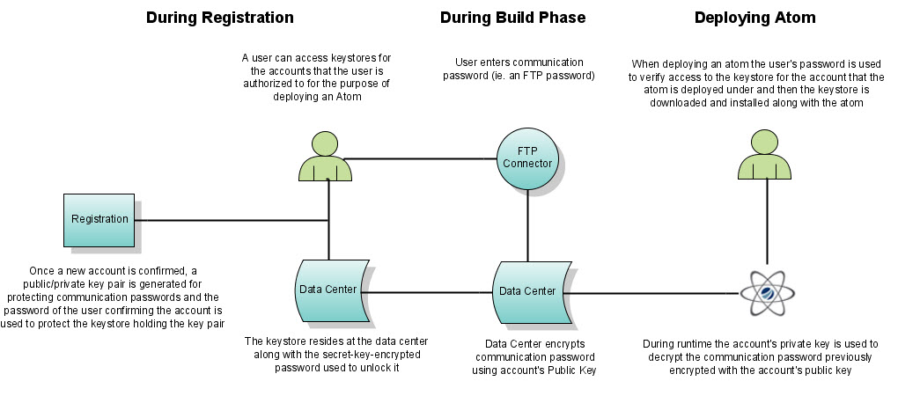
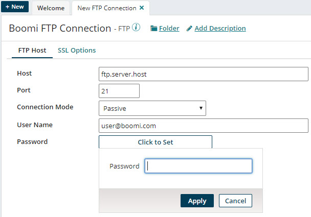

# Password encryption security

<head>
  <meta name="guidename" content="Platform"/>
  <meta name="context" content="GUID-89953624-ed1f-4c27-9b31-24f1bf2f2d74"/>
</head>

Security methods are applied when you initially register for Boomi.

The following diagram illustrates the security method applied and how it is used when storing password information.

When you register an account and activate it, we generate two keys for you: A private X.509 key and a public X.509 key. We store both the public certificate and the private key in our secure data center.

When you build a connector, notice the password encryption window where you enter the password. The password is then encrypted using the public key stored for your account. It is now in a format that only the account holder can decrypt because only the account holder has access to the password used to unlock the private key, which matches the public key used to encrypt the password.

When you deploy an Atom, it includes the entire encrypted string in the Atom. The credentials of your account supplied during Atom deployment unlocks the communication password at runtime.

## Boomi Key Management Service

If your password is stored as an environment extension, you can further encrypt it or other environment extension-based secrets with a key generated and managed by a HashiCorp Vault instance, which gives you additional flexibility in determining the level of security of your sensitive data. For more information, see [Boomi Key Management Service](../Integration/Integration%20management/atm-Key_Management_service.md).

## Boomi Secrets Management Service

Boomi's Secrets management allows customers to store their secrets in a remote secrets manager that they alone have access to. Boomi will never have access to this manager, since only references to secrets are entered in the Boomi platform.

By storing the references to customer secrets, you can rotate your secrets without having to redeploy Environment Extensions or new versions of Boomi processes.
For more information, see [Boomi Secrets Management Service](../Platform/c-atm-Secrets_Management.md).

