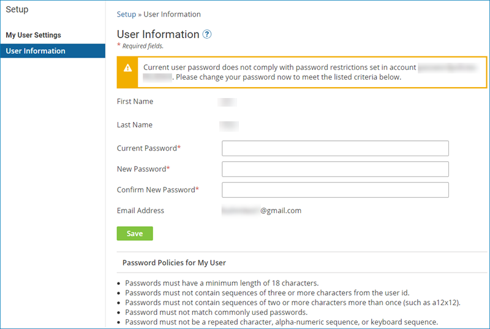

# Password Policy settings

<head>
  <meta name="guidename" content="Platform"/>
  <meta name="context" content="GUID-a30d9107-34c9-429a-b12e-c5821ce1df8b"/>
</head>

Use the **Password Policy** tab on the Settings page to manage password rules for accounts.

:::note

Custom password policy rules are available only to FedRAMP and SAML SSO administrators.

:::

The account owner manages the password rules, and may change an account's password requirements at any time. If an account owner changes an account's password policy, users of that account are prompted to change their password if their current password no longer complies.

When a user attempts to sign in or switch to an account with a stricter password policy and their current password does not comply, they are given the option to change their password. Users who opt to change their password are redirected to the User Information page, which lists the new password policy rules the user must fulfill, and informs them that they must enter both their current and new passwords. Users are signed out of all sessions and returned to the sign in page after changing their password on any session.

:::note

If a user's current password complies even after policy changes, they are not redirected and can sign in or switch accounts as normal.

:::

## Password and User Lockout Policy

After six incorrect sign in attempts, a user is locked from the and the account administrator receives an email indicating which user account is associated with the lockout. Once a user account is locked due to too many unsuccessful sign in attempts, it remains locked indefinitely until the user resets their password.

Upon getting locked out, a user can reset their password anytime by clicking the **Reset your password** link on the platform's sign in screen. To reset their password, the user is prompted to enter the email address associated with their user account. An email is then sent to the user with a link to reset their password. The email link is valid for 30 minutes only.

:::note

It is considered an invalid sign in attempt each time the user enters incorrect user name or password credentials, 2FA codes, or 2FA backup codes at the sign in screen. The user lockout policy is not configurable.

SSO users are locked from the platform when they enter six invalid API token entries. In some cases, SSO users may be able to use the **Reset your password** link while other cases require the account administrator to unlock the SSO user on their behalf. For more detailed information about how SSO are unlocked from the , see the topic [Single sign-on](c-atm-Single_sign-on_e9aa88ba-4724-424e-9694-14e8ebbe92ed.md).

:::
