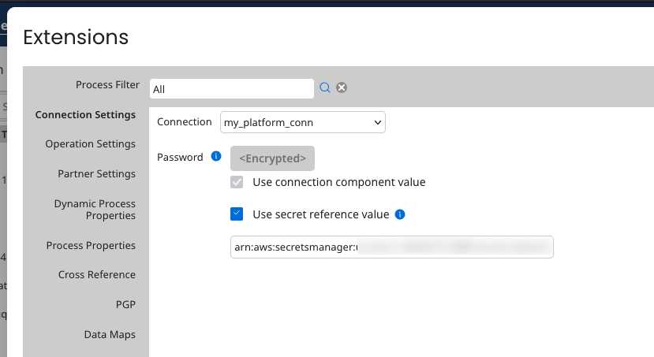

# Boomi Secrets Management Service

<head>
  <meta name="guidename" content="Platform"/>
  <meta name="context" content="GUID-599771b9-da67-4cba-8070-6680e4edc299"/>
</head>

Boomi's Secrets management allows customers to store their secrets in a remote secrets manager that they alone have access to. Boomi will never have access to this manager, since only references to secrets are entered in the Boomi Enterprise Platform.

### Service Structure

- **Platform**: In the Platform interface, you can configure environment extensions to point to specific secrets in your remote secrets manager.

- **Runtime**: In the Boomi container, you can use a new secrets management plug-in to retrieve secrets from the previously configured secrets manager and invalidate the secret cache on the container to prepare the container for a rotated secret.

- **AWS secrets manager**: You can store the secrets that you wish to reference in AWS's secrets manager. 

Any errors in execution will be stored in Process Reporting container logs.

## Secrets caching
Your secrets are never stored in the file system and are constrained to an individual Java classloader. These cached secrets are only stored for one hour, and do not persist between restarts, the creation of a new atom worker, or the creation of a new forked process execution.

In order to coordinate the caching of secrets with your secret rotation practices, the  provided refreshSecretsManager API allows you to reset the secret cache on all runtimes in an account. This ensures that the runtimes in your account directly retrieve secrets from the external secrets manager the next time the secret is referenced.

## Platform configuration 

:::note 

You must have the **SECRETS_MANAGEMENT** feature on the chosen account to utilize Secrets management. You can reach out to your customer success manager to start the process of feature activation.

:::

1. Navigate to **Atom Management** and select **Environment extensions**. Select the **Use Secrets references** checkbox to expose additional fields. 



2. For the container that you wish to use with secrets management, set the container property `com.boomi.container.aws.secretsmanager.enabled` to `true`.
3. For the container that you wish to use with secrets management, set the container property `com.boomi.container.aws.secretsmanager.region` to the region you wish to use with secrets management.
4. Call the environment extensions API with a **CloudManagedSecretsConfig** with `usesRemoteSecretsManager="true"`, `secretsManagerType="AWS"`, and `secretReference` set to the ARN of a secret in the AWS secrets manager for the account you are using.

## Runtime configuration 
1. Navigate to **Local System**, then select **Atom Properties**.
2. Configure the AWS credentials for the runtime instance by following any of the methods defined in the [Amazon Default provider chain documentation](https://docs.aws.amazon.com/sdk-for-java/latest/developer-guide/credentials-chain.html)

### Private Cloud Permissions 
Private clouds utilizing the Boomi Secrets Manager Service may need to add additional permissions for successful authentication with the AWS Secrets Manager. Before proceeding, note that allowing a cloud to use the Secrets Manager means every attachment on that cloud will have the same access to the Secrets Manager secrets.

You may need to modify the `procrunner/procworker/procbrowser` policy files to allow access to forked JVMs for successful authentication with the AWS Secrets Manager. See the [Default credentials provider chain](https://docs.aws.amazon.com/sdk-for-java/latest/developer-guide/credentials-chain.html) topic in the AWS SDK for Java 2.x Amazon Docs to learn more. 

* [Environment Variables](https://docs.aws.amazon.com/sdk-for-java/latest/developer-guide/credentials-chain.html#credentials-default)
````
  permission java.lang.RuntimePermission "getenv.(AWS_ACCESS_KEY_ID)";
  permission java.lang.RuntimePermission "getenv.(AWS_SECRET_ACCESS_KEY)";
  permission java.lang.RuntimePermission "getenv.(AWS_SESSION_TOKEN)";
````
* [The shared `credentials` and `config` files](https://docs.aws.amazon.com/sdk-for-java/latest/developer-guide/credentials-chain.html#credentials-default)
````
permission java.io.FilePermission "<path to .aws directory>/*", "read";
````

* [Amazon ECS container credentials](https://docs.aws.amazon.com/sdk-for-java/latest/developer-guide/credentials-chain.html#credentials-default)

You may use one of the following permissions, based on which environment variables exist.
````
permission java.lang.RuntimePermission "getenv.(AWS_CONTAINER_CREDENTIALS_RELATIVE_URI)";
permission java.lang.RuntimePermission "getenv.(AWS_CONTAINER_CREDENTIALS_FULL_URI)";
permission java.lang.RuntimePermission "getenv.(AWS_CONTAINER_AUTHORIZATION_TOKEN_FILE)";
permission java.lang.RuntimePermission "getenv.(AWS_CONTAINER_AUTHORIZATION_TOKEN)";
````

## AWS configuration 
1. Configure plaintext secrets in the AWS secrets manager with the account and region you allowed the container instance to access.
2. The ARN from the secret you are attempting to access should be the `secretReference` value for the corresponding environment extension on the platform.

## Extension API changes

Update Endpoint 
URL: `<platform URL>/api/rest/v1/boomi-internal/EnvironmentExtensions/<GUID for Environment Extensions>/update`

POST Sample Request

````
<bns:EnvironmentExtensions xmlns:xsi="http://www.w3.org/2001/XMLSchema-instance" xmlns:bns="http://api.platform.boomi.com/" environmentId="697b77f3-824d-4a5d-88db-f07145f780a5" extensionGroupId="" id="697b77f3-824d-4a5d-88db-f07145f780a5">
    <bns:connections>
        <bns:connection id="bb98cdce-aaec-4483-8ba2-c1bb3b7f8b9b" name="salesforce-nbv-test">
            <bns:field id="password" encryptedValueSet="true" usesEncryption="true" componentOverride="false" useDefault="false">
                <bns:CloudManagedSecretConfig usesRemoteSecretsManager="true" secretsManagerType="AWS" secretReference="arn:aws:secretsmanager:us-east-1:871876053574:secret:password"/>
            </bns:field>
        </bns:connection>
    </bns:connections>
</bns:EnvironmentExtensions>
````

Sample Response:

````
<bns:EnvironmentExtensions xmlns:xsi="http://www.w3.org/2001/XMLSchema-instance" xmlns:bns="http://api.platform.boomi.com/" environmentId="697b77f3-824d-4a5d-88db-f07145f780a5" extensionGroupId="" id="697b77f3-824d-4a5d-88db-f07145f780a5">
    <bns:connections>
        <bns:connection id="bb98cdce-aaec-4483-8ba2-c1bb3b7f8b9b" name="salesforce-nbv-test">
            <bns:field id="password" encryptedValueSet="true" usesEncryption="true" componentOverride="false" useDefault="false">
                <bns:CloudManagedSecretConfig usesRemoteSecretsManager="true" secretsManagerType="AWS" secretReference="arn:aws:secretsmanager:us-east-1:871876053574:secret:password"/>
            </bns:field>
        </bns:connection>
    </bns:connections>
</bns:EnvironmentExtensions>
````

Retrieve Endpoint
URL: `<platform URL>/api/rest/v1/boomi-internal/EnvironmentExtensions/<GUID for Environment Extensions>/`

Get Sample Response:
````
<bns:EnvironmentExtensions xmlns:xsi="http://www.w3.org/2001/XMLSchema-instance" xmlns:bns="http://api.platform.boomi.com/" environmentId="697b77f3-824d-4a5d-88db-f07145f780a5" extensionGroupId="" id="697b77f3-824d-4a5d-88db-f07145f780a5">
    <bns:connections>
        <bns:connection id="bb98cdce-aaec-4483-8ba2-c1bb3b7f8b9b" name="salesforce-nbv-test">
            <bns:field id="password" encryptedValueSet="true" usesEncryption="true" componentOverride="false" useDefault="false">
                <bns:CloudManagedSecretConfig usesRemoteSecretsManager="true" secretsManagerType="AWS" secretReference="arn:aws:secretsmanager:us-east-1:871876053574:secret:password"/>
            </bns:field>
        </bns:connection>
    </bns:connections>
````

Refresh Secrets API
Removes all secrets in the secret manager cache

Update Endpoint
POST Sample Request:
````
<SecretsManagerRefreshRequest xmlns="http://api.platform.boomi.com/" provider="AWS" />
````

````
<?xml version="1.0" encoding="UTF-8" standalone="yes"?>
<bns:SecretsManagerRefreshResponse xmlns:xsi="http://www.w3.org/2001/XMLSchema-instance" xmlns:bns="http://api.platform.boomi.com/" message="AWS Secrets Manager refresh messages sent to all containers in <account id>"/>
````