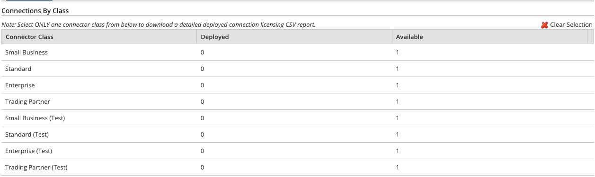

# Test connection licensing 

<head>
  <meta name="guidename" content="Platform"/>
  <meta name="context" content="GUID-04708d54-8ea3-453f-8dac-3e2e6b72330b"/>
</head>

Integration tracks the number of production and test connections your account has purchased and how many your account is using in processes that are deployed to production and test environments.

Integration has two types of connection licenses: production connection licenses and test connection licenses. Production connection licenses are available in all editions of Integration. Test connection licenses are available to accounts in which environments and test connections are enabled. Environments are available in the Professional, Professional Plus, Enterprise, and Enterprise Plus Editions.

:::note 

Test connections are available in all accounts created after January 2014. If your account was created prior to January 2014, contact your Boomi representative to have test connections enabled. Boomi assigns all of the test connections.

:::

- If you are using the Base Edition (which does not include environments) you have access only to regular production connection licenses. Your production connection licenses are used by processes that are deployed to production Atoms and a Boomi Atom Cloud. If you need to test your processes you can use Test mode, however, Test mode has restrictions on data size, the number of documents, etc.

- If you are using an edition that includes environments and test connections, you have access to production and test connection licenses. Your production connection licenses are allocated to your production environments for connections in processes that execute on Atoms and production Atom Clouds. Your test connection licenses are allocated to your test environments for connections in processes that execute on Atoms and the Boomi US Test Atom Cloud or EU Test Atom Cloud.

Having a separate test environment allows you to conduct end-to-end functional testing of processes, without Test mode restrictions and without affecting processes that are running in production. When pending Atom and connector updates become available during the Runtime Release period, they are also available on the Test Atom Clouds. Therefore, you can use a Test Atom Cloud to test your processes prior to the release.

Test connection licenses and the Test Atom Clouds should be used for functional testing of processes only. They should not be used for performance testing or benchmarking. The response times that you encounter on a Test Atom Cloud will not be reflective of how your processes will run on a production Atom Cloud.

:::note

When you use test connections in a test environment, you do not receive email alerts about deployed process executions or about the status of Atoms on which they are executing. You do receive RSS feeds and you can use the Event object in the API to query notifications.

:::

## Tracking test connection licenses 

Test connection licenses exist for each connector class. The Licensing page’s Connections tab (**Settings** > **Account Information and Setup** > **Licensing**) shows the number of connections that your account has deployed, and has available, grouped by class. Production connections do not have a designation after their connector class name. Test connections have “(Test)” after their connector class name.

## Using test connection licenses 

To use test connection licenses you must:

- Use an Integration edition that includes environments and test connections.

- If your account was created prior to January 2014, contact to have test connections enabled.

- See the [Integration editions page of our website](https://www.boomi.com/products/editions/compare/) to find out how many test connections come with your edition. If you need additional test connections, contact your representative.

- Add an environment and classify it as a test environment. (Environments added prior to the January 2014 release are classified as production environments and they cannot be changed.)

- Deploy processes to the test environment.

- If you use a local Atom, attach it to the test environment.

- If you use a private Atom Cloud:

    - Add an Atom Cloud and classify it as a test Atom Cloud. (Atom Clouds added prior to the January 2014 release are classified as production Atom Clouds and cannot be changed.)

    - Attach the test Atom Cloud to the test environment.

- If you use the US Test Atom Cloud or EU Test Atom Cloud, attach it to the test environment.

-   Run a process and enable the Test Atom Cloud.

:::note 

If you are a partner who already has “development” or “test” Atom Clouds, contact your Boomi partner manager. Your partner manager will assist you in obtaining test connection licenses and migrating your existing Atom Clouds to the test connection licenses.

:::
