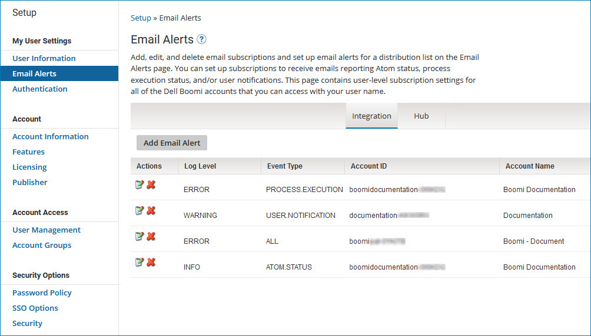
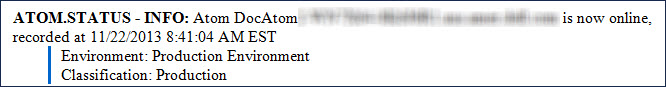
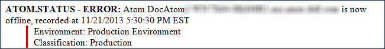
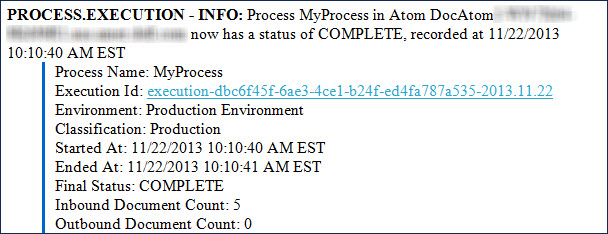
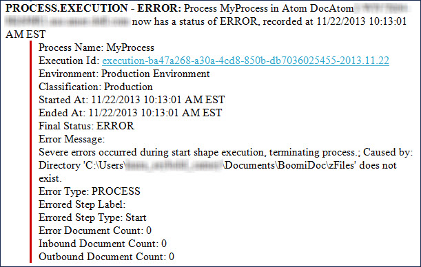
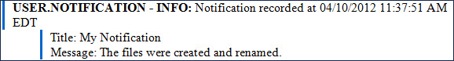

# Email Alert settings 

<head>
  <meta name="guidename" content="Platform"/>
  <meta name="context" content="GUID-B227D0A1-17B1-419E-9579-CB33679F6B5E"/>
</head>

Add, edit, and delete email subscriptions and set up **email alerts** for a distribution list on the Email Alerts tab.

You can set up subscriptions to receive emails reporting Atom status, process execution status, and/or user notifications. The tab contains user-level subscription settings for all of the Boomi accounts that you can access with your user name.

:::note 

On the **Email Alerts** tab, you manage subscriptions to **Integration** activity on the Integration sub-tab. On the **Hub** sub-tab, which is visible only to users of accounts enabled for Boomi DataHub, you manage subscriptions to Boomi DataHub activity. The information in the remainder of this topic and its subtopics relates to subscriptions to Integration activity. For information about subscriptions to Boomi DataHub activity, see the [Adding an email alert](/docs/Atomsphere/Master%20Data%20Hub/Governance/t-mdm-Adding_an_email_subscription_76a1dd73-caa8-4f7e-a43f-bb0c3d7ca1fe.md).

:::

The following describes email alert functionality:

-   For a given subscription, you can choose the type of event about which you want to be notified and the severity level.

    -  The event types are ATOM.STATUS, PROCESS.EXECUTION, USER.NOTIFICATION, or ALL, which includes all three event types.

    -   The logging levels are INFO, WARNING, or ERROR. For example, you may want to receive INFO logging-level emails about Atom status, and ERROR logging-level emails about process executions. Or one person in your company may want to receive only emails about Atom status and another person may want to receive only emails about user notifications. INFO-level subscriptions also include WARNING- and ERROR-level alerts.

-   Every 15 minutes, Integration polls the accounts in the Alerts list. Depending on your Log Level settings, Integration sends the proper email alerts for the event type(s) to which you are subscribed.
  
-   All alerts that are reported within a 15-minute period are grouped by event type and sent in one email. When a user sets a time zone on the User Information tab, messages use that time zone for dates and times.

    :::note  
    
    If your account generates an unusually large volume of events during a single 15-minute interval, the platform may send additional emails to fully report all events that occurred.

    :::

-   Low latency processes do not generate email alerts. Generally, any processes run on the Atom worker are low latency and therefore do not generate email alerts. For Web Services Server listeners that use Low Latency Debug on the Cloud, General mode HTTP calls also do not generate email alerts.

-   Email alerts set up before an event type is selected are subscribed to ALL event types. To change the event selection, delete the existing email alert, then create a new email alert that is subscribed to the event type at the logging level about which you want to be notified.

-   Processes deployed—and Atoms attached—to environments with the Test classification do not generate email alerts about executions or about the status of Atoms. However, you do receive RSS feeds, and you can use the Event object in the API to query notifications.

## Atom Status alerts 

The ATOM.STATUS alert identifies a recorded time when an Atom in the account is online or offline.

-   Online — This status is sent for the INFO log level when Atoms are down and then started.

    

-   Offline — This status is sent for the INFO through ERROR log levels when Atoms go down or are disabled.

    The Boomi Enterprise Platform detects that an Atom is offline when it does not receive communication from the Atom for more than a minute (typically, a down Atom can be detected as early as 45 seconds and as late as four minutes). The Atom status alert system monitors for Atom status changes in 15 minute intervals, and then issues an email if an Atom status change was detected.

    :::info 
    
    Atom alerts that occur sooner than a minute may indicate a temporary network interruption, rather than a true Atom outage.

    To determine if an Atom outage has occurred or is occurring, visit the **Atom Information** tab of the Atom Management page to confirm the Atom's status and the **Startup Properties** tab to view the Atom's last restart time to verify whether an outage occurred and recovered.

    :::

    For example, an alert schedule runs at the top of every hour starting at 12:00 A.M., and monitors for status changes at 12:15, 12:30, 12:45, and so on. If the platform recognizes that an Atom is offline at 12:01, the status isn't sent until 12:15 per the schedule, about 14 minutes later. In the same scenario, the Atom is offline at 12:14 A.M. and the alert is issued only a minute later at 12:15. The cadence in which this schedule runs explains why Atom status emails are received at varying times in relation to when an Atom is offline.

    

## Process Execution alerts 

The PROCESS.EXECUTION alert identifies the start and end time for the execution of an Atom's process. The number of inbound and outbound documents are recorded, along with any documents that may have encountered errors during the process execution. The alert includes the process’ execution ID and a link to the execution. Clicking the link takes you to the process on the Process Reporting page. INFO log level alerts always send an execution status if the process runs to completion. Accompanying warning and error alerts can also be logged, depending on your process flow.

This INFO log level alert indicates that the process has completed:

This ERROR log level alert indicates that the process has an error:

You can use the Exception step in your process flow to trigger PROCESS.EXECUTION alerts. You can also use the Exception step to send a customized message for the first document that encounters an error and to stop all or any documents that reach this step.e.

## User Notification alerts 

The USER.NOTIFICATION alert identifies a Notify step having the **Enable Events** option that was included in a process execution. The message level (Info, Warning, or Error) set in the Notify step affects the type of email alert that is sent, but it does not stop a document or set of documents from processing to completion. The Title and Message fields in the USER.NOTIFICATION alert display the results of those configurable fields in the Notify step:

