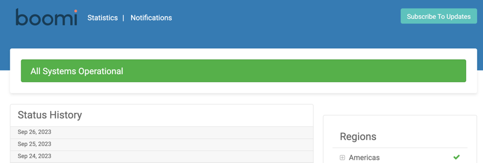

# status.boomi.com

<head>
  <meta name="guidename" content="Platform"/>
  <meta name="context" content="GUID-d9d2c76a-e748-4ef1-ba2e-2694f3684a94"/>
</head>

Timely and accurate information about the status of the Boomi Enterprise Platform and the availability of Boomi-managed Atom Clouds is critical to your business. The [ Boomi status website](https://status.boomi.com/) is Boomi’s status and incident communication system, providing you with current information regarding system availability and planned maintenance events.

The [ Boomi status website](http://status.boomi.com) provides system availability, release date notifications, and performance metric information to customers, application vendors, and system integrators.

The website puts you in control of the notifications you want to receive about status changes and incidents by allowing you to choose flexible subscription options. Additionally, the website is available 24 hours per day, 7 days per week, so you can check the current availability of the Boomi production Atom Clouds, Test Atom Clouds, Hub Clouds, and the status of the Boomi Enterprise Platform.

You can also reach the [ Boomi status page](http://status.boomi.com) website by clicking **Platform Status & Announcements** located in the footer of any Documentation page.

:::note

While you can subscribe to notifications about Boomi Test Atom Clouds, as well as check their availability, Boomi does not report their performance history because there is not an established Service Level Agreement (SLA) for Test Atom Clouds.

:::

The status website also shows:

- Number of integration processes that ran over the last 30 days, including a table that shows the numbers by day.

- Total number of Atoms deployed in Boomi Atom Clouds and on-premise.

- Total number of mappings indexed by Boomi Suggest.

- Total number of functions indexed by Boomi Suggest.
  
- Performance history of the Boomi Enterprise Platform and Atom Clouds by date for the past month, including the number of integration processes that ran on each date.
