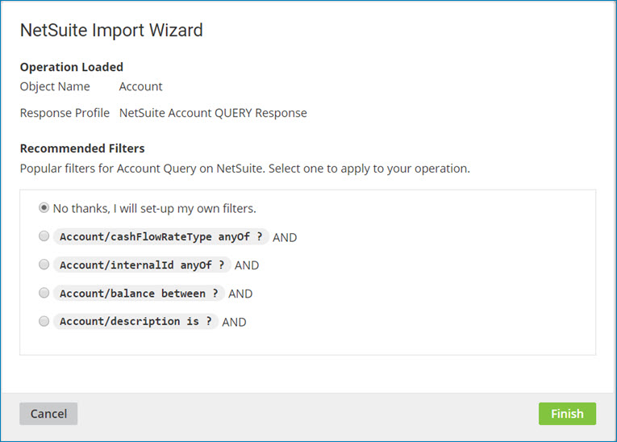

# Using recommended connector Query filters

<head>
  <meta name="guidename" content="Platform"/>
  <meta name="context" content="GUID-f06c5702-17e6-48c1-b983-241ada8e1ca0"/>
</head>

By opting-in to Data Collection, you benefit with an improved user experience. One feature you can take advantage of is recommended filters to quickly and easily set up connector Query operations including the operation, response profile, fields, and filters. Use the recommended filters as a shortcut to build your processes faster and automate this repetitive task.

## Before you begin

Verify that Data Collection is enabled for your account and you have not opted out. If you have opted out, or if our data intelligence cannot build recommended filters for a specific connector, you will not see suggested Query filters.

:::note

Recommended filters is currently in a technology preview giving you early access to the filters. Recommended filters are useful so you can test the recommendations, see how they work, and provide feedback using Boomi Community.

:::

## Procedure

1. Create a process.

2. Add a connector to the process with the Query operation (for example, NetSuite, OData Client, etc.)

3. When configuring the connector operation, select QUERY in the Connector Action drop-down list click Import.

   The Import Wizard appears.

4. In the Import Wizard, enter the following information:

   a. In the **Browse in** field, choose **Cloud** or **Atom**.

   b. (Optional) If you selected Atom, select an Atom from the list.

   c. Select a connection.

   d. (Optional) Select any additional options that may be available for the connector's Query operation.

5. Click **Next**.

6. In the Object Type drop-down list, select an object (for example, the Account object). The list of available objects depends on the service and version of the API you are connecting to.

7. Click **Next**.

   The Query operation is loaded and the recommended filters for the selected object type appear.

   

8. Select a filter from the list, or choose the option to set up your own filters.

   Any changes you make to a recommended Query filter only apply to the process you are building for your account. However, if the filter you develop is unique compared to those already recommended, it is contributed to the community of data for future use.

9. Click **Finish**.
