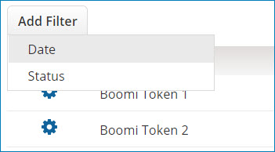

# Searching for user API tokens by using a filter 

<head>
  <meta name="guidename" content="Platform"/>
  <meta name="context" content="GUID-50fccfc2-dce0-47b2-b4d5-67ac1443ee5e"/>
</head>

Filter the list of user API tokens on the **Token Management** page by using date and status filters.

## Before you begin

To view the **Token Management** page, you must have Account Administration and API Access privileges.

## About this task

Use the following steps to find user API tokens using filters:

## Procedure

1.  Select **Settings** \> **Account Information and Set** and click the **Token Management** tab.

2.  Click **Add Filter** above the list of user API tokens. You may need to clear any filters that may have already been applied.

    The filter list dialog opens.

3.  Next, do one of the following:

    -   Click the **Date** filter to search the list by tokens that have been added in the past hour, past 24 hours, past week, or a specific date range. Select one of the options.

        Selecting the Date Range option requires you to enter the beginning and end time and the date in which to apply your search. The time values must be entered in a 24-hour format, and the date values must be entered in a mm/dd/yyyy format. The default time values are 00:00 and 23:59 representing 12 a.m. and 11:59 p.m., and the default date values are the current date and exactly a month prior.

    -   Click the **Status** filter to search the list by tokens that are in an Enabled or a Disabled state. Select one of the options.
4.  Click **Apply** to apply the filter.

    The API tokens that match the combination of filters you selected appear in the list.

5.  **Optional:** To select different filters, click , change or add a selection, and click **Apply**.

6.  To reset the list, click the **Clear all filters** icon . To delete a single filter, click the Clear icon  next to the filter you wish to clear.

## Results

After you have located the API token, you can view details, revoke, disable or enable it as needed.