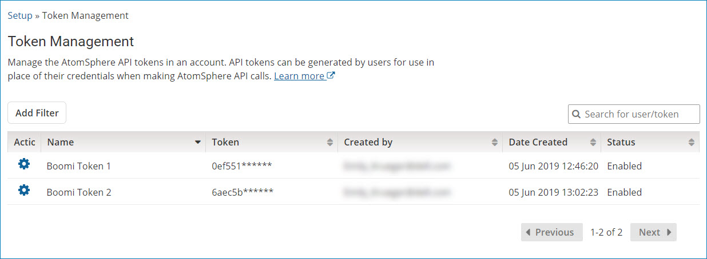

# API Token Management

<head>
  <meta name="guidename" content="Platform"/>
  <meta name="context" content="GUID-32da8ba5-1209-45ae-81a4-5a0ae8bb6392"/>
</head>

Account administrators can view and manage all the API tokens generated by users of a given account.

Using the **Token Management** page in Setup, account administrators have the ability to view any API tokens generated by users on an account, change a token's active status, or permanently delete a token on a user's behalf. Administrators have the ability to manage tokens in the event that a user's account is compromised, or when the user is temporarily unable to access the API.

In the Token Management page, account administrators can view the following:

- The name of the API token that was created under the account
- The first 6 characters of the token string
- The user who created the token
- The date the token was created
- The token's enabled or disabled status

As an account administrator, review the related topics to learn how to add, revoke, rename, enable, and disable API tokens from the Setup menu.
