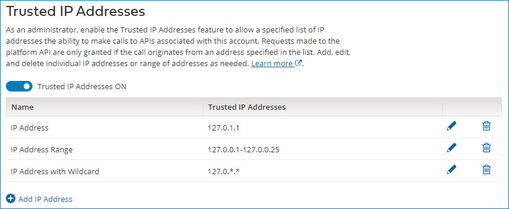

# Trusted IP addresses management

<head>
  <meta name="guidename" content="Platform"/>
  <meta name="context" content="GUID-38edd736-b192-4196-be4b-d73088731e91"/>
</head>

As an administrator, use the **Trusted IP Addresses** page in Settings to specify a list of trusted IP addresses that are authorized to make AtomSphere and Partner API calls from the account.

Using the **Trusted IP Addresses** page, administration users can add single IP addresses, IP addresses with wildcards, and ranges of IP addresses for the account they manage. When the Trusted IP Address feature is enabled, only the specified list of IP addresses defined on the account can interact with AtomSphere and Partner APIs. Administrators may add up to 25 IP address entries regardless of type. For example, if an an account administrator enters an address range of 127.0.0.1-127.0.0.25, this range counts as a single entry. Administrators also have the ability to edit and delete each range or address on the Trusted IP Addresses page.

Users receive an error when attempting to use an API from an address that is not specified in the list of trusted IPs. API connectors are subject to the same restrictions, as explained in the proceeding note.

:::note

Users that use AtomSphere API and Partner API connectors to access the AtomSphere APIs are immediately impacted once the Trusted IP Addresses feature is enabled on the account. On the Trusted IP Addresses page, account administrators are required to add the IP addresses of all Atom Clouds that account users use to browse and test their API connectors. Otherwise, users encounter an error. To view the list of IP Addresses for Atom Clouds, visit [Hostnames and IP addresses for the Atom Clouds](./r-boo-Hostnames_and_IP_addresses_for_Atom_Clouds__0d150522-9457-4c37-b5a9-a8ad664490bd.md).

:::

:::info

The Trusted IP feature does not allow users to make API calls based on their IP address alone. All normal account authentication and authorization controls must also be valid for an API request to proceed.

:::

If you run integration processes on a  Atom Cloud and send requests to other Internet-based services or applications on your network, you also need to add those applicable IP addresses listed in the "Accepting requests from the  Atom Clouds" section from the linked topic above.
