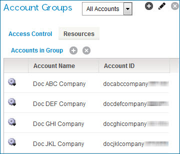

# Access Control tab and account groups

<head>
  <meta name="guidename" content="Platform"/>
  <meta name="context" content="GUID-8a4e3ba8-9bf2-4196-b806-be7a954b3fbc"/>
</head>

The All Accounts account group displays a table of accounts that the currently-selected primary account can assign to an account group.

By default, the All Accounts account group is displayed. If the currently selected account is not a primary account, then no accounts appear in the table. The primary account is not a member of the account groups to which it assigns accounts.

In this example the "Documentation" account is the currently selected primary account. When you view the All Accounts account group, you can see four accounts that the Documentation primary account can assign to account groups.

:::note

If you have access to multiple accounts, where some are set up for single sign-on and some are not, you can see differences in the accounts that you can access.

:::

The Accounts in Group table displays all accounts that the currently selected primary account can assign to an account group. This is where you add and remove accounts from an account group.

- **Account Name** - The name of the account, as displayed in the Account Name field on the Account Information tab.

- **Account ID** - The account's internal ID.

- **View Account Group Membership** \(icon\) - Used to view the account groups of which the selected account is a member.

- **View Account's Assigned Users** \(icon\) - Used to view the members of the selected account.
