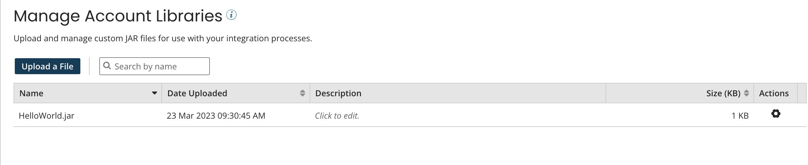

# Account Library settings

<head>
  <meta name="guidename" content="Platform"/>
  <meta name="context" content="GUID-C9DE8DD5-7882-47AD-A85E-CE1605D27033"/>
</head>

Upload and manage files for your integration processes.

On the **Manage Account Libraries** page \(**Settings** \> **Account Information and Setup** \> **Account Libraries**\) you can, for example, manage custom Java Archive \(JAR\) files and custom script libraries, and specific driver files for connectors.

Each Boomi account has access to 200 MB of space for uploaded files. The current usage for the account is shown in the bottom left corner; for example, **5.4/200.0 MB \(5%\) used**.

The custom JAR files that you upload can be included in a Custom Library component and that component can be deployed to any Atom, Molecule, Atom Cloud, or environment, including the Atom Clouds. A corresponding SHA256 cryptographic hash must be uploaded alongside the uploaded JAR file.

Uploaded or imported files pass through a virus scanner first. If the scan detects a virus, you receive an error message, and the scan rejects the file. If an error persists, contact Boomi Support.

:::note

You must have the Build Read and Write Access privilege and the Developer privilege to upload custom JAR files.

:::

By default, the files are sorted by name. You can also sort the list by date uploaded or size.

You can search for previously uploaded custom JAR files by typing in the **Search by name** field. As you type, the list of JAR files is filtered to include only files whose names match the typed characters partially or completely. Pressing **Esc** or clicking  clears the field and stops filtering.

- **Name** - The name of a JAR file that has been uploaded.

- **Date Uploaded** - The date and time at which the JAR file was uploaded.

- **Description** - Editable field in which you can specify a description for the JAR file.

- **Size** - The size of the JAR file, in kilobytes.

- **Actions** - You can use the ** Actions** menu to perform the following actions for a JAR file:

   - **View Contents** – Display the contents of the file.
   - **View Usage in Custom Library Components** – Display a list of Custom Library components that reference the file.
   - **View Deployments** – Display a list of Custom Library deployments that reference the file.
   - **Delete** – Delete the file from your account library.
