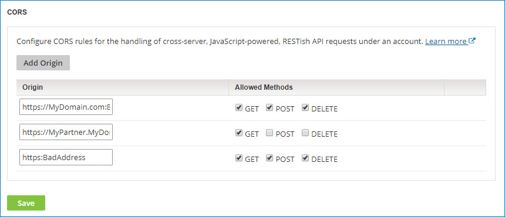

# Account security for CORS

<head>
  <meta name="guidename" content="Platform"/>
  <meta name="context" content="GUID-b98840c5-72ed-400b-b0bc-b1d7da9ba240"/>
</head>

Use the CORS page \(**Settings** \> **Account Information and Setup** \> **AtomSphere API** \> **CORS**\) to configure CORS rules for RESTish requests in the and Partner APIs.  

## CORS

CORS rules govern the handling of cross-server, JavaScript-powered, RESTish API requests under an account.

**Add Origin**  
Provides controls for adding a CORS rule to the list. Each rule specifies:

- An origin for matching cross-server RESTish API requests under the account. The matching criteria specified for an origin are protocol \(HTTP or HTTPS\), originating domain, and originating port. A matching request is one that matches on all criteria.

- The allowed HTTP methods — GET, POST, DELETE — for matched requests.

**Origin**  
Specifies the origin in URL syntax:

- Type `://` as the delimiter between protocol and domain.

- If you are specifying a port explicitly, type : as the delimiter between domain and port.

For example: `https://mydomain.com:8081`.

The default ports are 80 for HTTP and 443 for HTTPS.

The wildcard character \* is permitted in the domain — for example, \*.mydomain.com. However, specifying only \* \(to represent any domain\) is not permitted.

**Allowed Methods**  
Sets the allowable HTTP methods for requests from the specified origin.

-  **GET** - If selected, GET requests are allowed.
- **POST** - If selected, POST requests are allowed.
- **DELETE** - If selected, DELETE requests are allowed.

Highlighting a rule and clicking the Delete icon **** deletes that rule.
