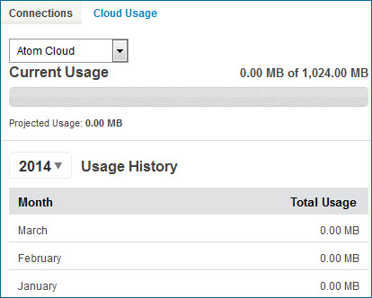

# Cloud Usage tab 

<head>
  <meta name="guidename" content="Platform"/>
  <meta name="context" content="GUID-d406e917-9586-41d8-be17-944b0254d559"/>
</head>

The **Cloud Usage** tab in **Licensing** shows your account's total usage of each Atom Cloud.

At the top is a list of the Boomi Atom Clouds to which your account has access. Below is the usage by month for the selected Cloud and projected usage.

Total Usage is calculated using the formula (data in + data out) /2.

For example, your inbound documents total 100K and your outbound documents are sent to two places, one that totals 200K and one that totals 50K. Your usage would be (100 + 200 + 50) /2 or 175K.

The following details apply to your volume usage:

-   The sum is the total document size that flows through connector steps. Data flowing through connector call lookups, such as Map functions, are not counted.

-   Each Atom Cloud can process up to 1 GB of volume per month at no charge. Additional charges may be applied when you exceed this limit.
-   If your account has more than one Atom set up in an Atom Cloud, the data is aggregated into an Atom Cloud total and can use up to 1 GB of volume per month at no charge.

-   Web services listen operations and return document steps, which are treated as inbound and outbound connectors, are counted towards volume usage.

-   Low latency process data is counted towards volume usage even though these executions are not reported in Process Reporting.

-   Local Atoms are not counted in volume usage.

If you are using a Integration edition that includes environments and Test Connection Licensing, and if you have test connection licenses, then you have access to the Boomi Test Atom Clouds, which appear in the Atom Cloud list. The Test Atom Clouds are billed at half the rate of the Production Atom Cloud.

**Name**  
**Description**

**list**  
Used to select one of the Atom Clouds to which your account has access. Usage statistics for the selected Cloud appear on the tab.

Only Atom Clouds administered by appear in this list. Private Atom Clouds administered by partners, for example, do not appear in this list. Also, only Atom Clouds — not Atoms attached to Atom Clouds — appear in this list.

**Current Usage —** *n.nn* **MB of 1,024.00 MB**  
Shows the volume of data in MB processed on the selected Atom Cloud for the account in the current month.

**Projected Usage —** *n.nn* **MB**  
Shows the current month's projected usage based on the account's current monthly volume. This is calculated as: \(\(current usage/current day of the month\) \* number of days in the month\).

**Usage History**  
Shows by year and by month the volume of data in MB processed on the selected Atom Cloud for the account.

Contact your account representative if you have any questions about Cloud usage.