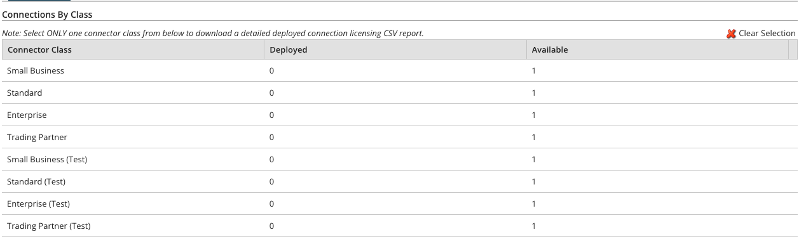

# Connections tab’s Connections by Class table 

<head>
  <meta name="guidename" content="Platform"/>
  <meta name="context" content="GUID-d2ee3527-fee6-45c3-be6c-06ce2781681e"/>
</head>

The Connections by Class table shows the number of connections that the account has deployed, and has available grouped by class.

The classes are Small Business, Standard, Enterprise, and Trading Partner.

Test connection licensing is available to accounts in which environments and test connections are enabled. If you use environments, the numbers of deployed and available connections appear to the right of the “Test” connector classes. If you do not use environments, the Test connector classes appear in the table but the numbers are set to zero.

For more information, see the topic [Test connection licensing](./c-atm-Test_connection_licensing_04708d54-8ea3-453f-8dac-3e2e6b72330b.md). Boomi assigns all test connection licenses. Contact your Boomi representative if you are interested in licensing test connections.

**Connector Class**  
Categorical name for Integration connections. (See the [Supported Applications](http://www.boomi.com/products/evaluate/supported_applications) page on our web site.)

Production connections do not have a designation after their connector class name. Test connections have “(Test)” after their connector class name.

**Deployed**  
Total number of deployed connections, by class.

**Available**  
Total number of remaining connections, by class.

:::info

When the License Enforcement feature is OFF, and the current deployment limit is greater than the available count, the values under the ‘Available’ column are marked as -1, -2, -3, etc, as per the number of additional deployments, and the values are marked in red as the values are less than zero.

Refer the [License Enforcement](./int-License_Enforcement.md) page for more information.

:::
