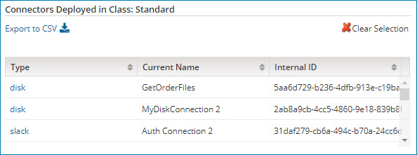

# Connections tab’s Connectors Deployed in Class table 

<head>
  <meta name="guidename" content="Platform"/>
  <meta name="context" content="GUID-0cd009a9-6570-4a67-8331-ff9099ef1b4c"/>
</head>

Selecting a connector class in the Connections by Class table populates the Connectors Deployed in Class table.

:::note

To export a list of connectors deployed in a class to a CSV file, click ** Export to CSV**.

:::

The following information is displayed for each deployed connector in the selected class:

**Name**  
**Description**

**Type**  
Connector type.

**Current Name**  
Name of Connection component.

**Internal ID**  
Full internal Connection component ID.