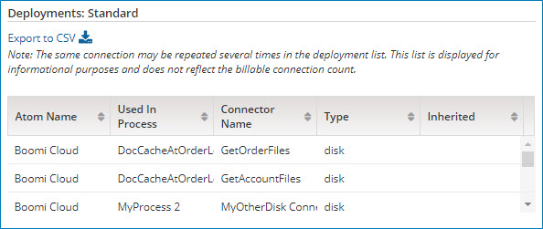

# Connections tab’s Deployments table 

<head>
  <meta name="guidename" content="Platform"/>
  <meta name="context" content="GUID-2cf4462a-8499-42c9-940f-8b04c94f9c42"/>
</head>

The Deployments table shows all instances of a connection deployed per process and per Atom.

If you select a connector class from the Connections by Class table, the Deployments table shows only the connections for the selected class. Then, if you select a connector type from the Connectors Deployed in Class table, the Deployments table shows only the connections for the selected class and type.

A connection may be listed several times in the Deployments table. The list is for informational purposes only and does not reflect the actual billable connection count. It is simply a view of all connections per process and per Atom (and optionally per connector class and connector type as well).

:::note

To export a list of connection deployments to a CSV file, click ** Export to CSV**.

:::

The following information is displayed for each connection deployment:

**Name**  
**Description**

**Atom Name**  
Configured Atom name or host name of the server.

**Used in Process**  
Name of the process in which the connection is deployed.

**Connector Name**  
Name of the connection component.

**Type**  
Connector type.

**Inherited**  
his feature has been retired.

**Related information**  

[Licensing settings](c-atm-License_management_7f3b0031-d80a-49a4-a744-e8878108cd38.md)

[Exporting connection licensing data to a CSV file](t-atm-Exporting_connection_licensing_data_to_a_CSV_file_0c2a524c-929c-4934-90c1-8254a0aac384.md)