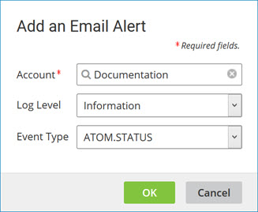

# Email Alerts tab

<head>
  <meta name="guidename" content="Platform"/>
  <meta name="context" content="GUID-44b1ad6f-32db-46d9-82d4-25bb76765b0c"/>
</head>

Manage Integration email subscriptions and specify log level and event type.

Use the **Integration** tab on the **Email Alerts** tab in the Settings page to manage email subscriptions specific to accounts in which you have access.

**Add Email Alert**  
Clicking this button opens the Email Alert dialog for the purpose of adding a subscription.

**Subscriptions list**  
Lists existing subscriptions and their properties and lets you edit and delete individual subscriptions. Clicking a column heading selects the property by which to sort the list. Clicking the selected property reverses the sort order.

For each existing subscription, the following Actions are available:

- ** Edit Subscription** — opens the Email Alert dialog for the purpose of editing the subscription.

- ** Delete Subscription** — initiates a request to delete the subscription. In the confirmation dialog:

    - Clicking **OK** executes the request.

     - Clicking **Cancel** cancels the request.

For each existing subscription, the following properties are shown.

- Log Level — event severity levels applicable to the subscription:

    - INFO — the email alerts include all execution information, warnings, and errors for active processes and all Atom status information.
    - WARNING — the email alerts include all warning and error information for active processes and disabled Atoms.
    - ERROR — the email alerts include all error information for active processes and disabled Atoms.

- Event Type — category of information included in the subscription

    - ALL — provides information for all three event types.
    - ATOM.STATUS — identifies a recorded time when an Atom in the account is online or offline.
    - PROCESS.EXECUTION — provides information about a process execution.
    - USER.NOTIFICATION — provides information from a Notify step having the **Enable Events** option that was included in a process execution.

- Account ID — account ID that appears in the email alerts. This is most commonly used for support purposes. The account ID also appears on the Account Information tab.

- Account Name — name of the account to which the subscription applies.

In the Email Alert dialog:

**Account**  
Clicking the **Browse** icon opens the Choose Account dialog in which you select the account to which the subscription applies.

:::note

When you are editing an existing subscription it is not possible to select a different account.

:::

**Log Level**  
Selects the event severity levels applicable to the subscription. See the subscriptions list description in the previous table.

**Event Type**  
Selects the type of event applicable to the subscription. See the event type list in the previous table and in the Managing Email Alerts topic.

**OK**  
Add or edits the subscription and closes the dialog.

**Cancel**  
Closes the dialog without adding or editing the subscription.
