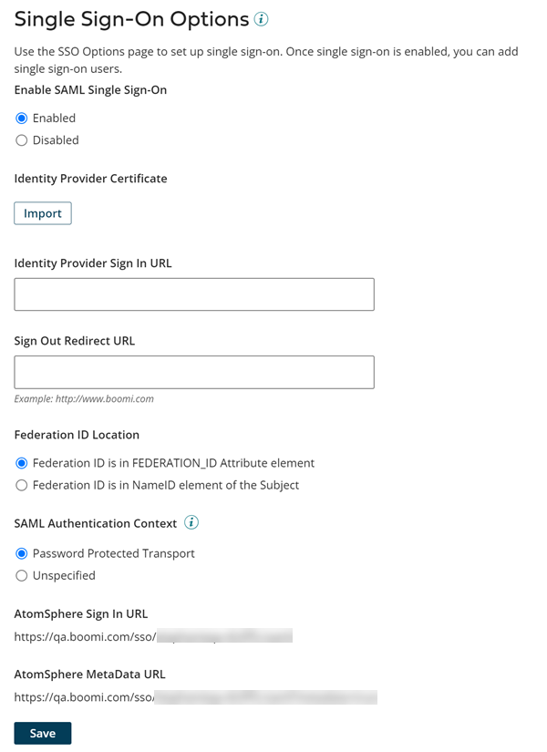

# SSO Options tab

<head>
  <meta name="guidename" content="Platform"/>
  <meta name="context" content="GUID-752277F0-1F0C-4D42-80F4-92469F84C29C"/>
</head>

The **SSO Options** tab appears on the Settings page and is visible only to administrators who have Advanced User Security.

You must set up single sign-on before adding single sign-on users.

:::note

This feature is part of Advanced User Security, which is available in the Enterprise and Enterprise Plus Editions, and as an add-on to the Professional and Professional Plus Editions. Consult with your Boomi account representative to enable this functionality.

:::

If you are an administrator and if your account is using single sign-on, the SSO Options tab is where you enter information about the identity provider's certificate, sign in URL and sign out redirect URL; the page also shows the service provider's sign in URL and metadata URL.

If your account is not using single sign-on, the SSO Options tab displays the Enable SAML Single Sign-on option set to **Disabled**.

**Enable SAML Single Sign-on** -   
Set to **Enabled** if the user and account are using single sign-on.

**Identity Provider Certificate** -   
Public certificate of the identity provider. If an identity provider certificate has not yet been imported for the account, clicking **Import** initiates the import process.

**Identity Provider Sign In URL** -  
URL to the identity provider's single sign-on service. This is your identity provider's single sign-on service HTTP-POST endpoint.

**Sign Out Redirect URL** -  
URL that the SSO-only user or SSO administration user is redirected to upon signing out of the . This URL applies to the federating SSO user account that the user signs into. For example, this field can be set to point to the URL used for signing into an identity provider.

:::note

SSO-only users and SSO administrators are redirected to the provided URL if their session is manually or automatically terminated. This applies to users of accounts with the **Lock and terminate inactive sessions** feature enabled in **Settings** \> **Account Information and Setup** \> **Security** and who have the Sign Out Redirect URL field populated in **Settings** \> **Account Information and Setup** \> **SSO Options.**

:::

**Federation ID Location** -   
The federation ID can come from one of two places in the SAML Response document:

- Federation ID is in FEDERATION\_ID Attribute element — This is the default setting.
- Federation ID is in NameID element of the Subject element.

**Name ID policy** - 
The Name Id policy option appears only when the **Federation ID is in Name ID element of the Subject element** option is selected as the Federation ID Location. The following selections indicate how to interpret the name attribute based on the needs of your identity provider.

- Transient — \(default\) Indicates that the content of the element is a nonconstant and temporary value that should not assume any standard meaning.
- Unspecified — Indicates that identity provider can interpret the NameID attribute.

**SAML Authentication Context** - 
Determines how a user is able to authenticate. Select from the following options:

- **Password Protected Transport** - \(Default\) Requires a username and password for authentication.
- **Unspecified** - Any type of authentication, such as token authentication, is accepted.

**SAML Authentication Context Comparison Levels** - 
Specifies how to evaluate the site provider's requested authentication context. Available only if the SAML Authentication Context is set to **Password Protected Transport** or **Unspecified.**

- **Exact** - The resulting authentication context in the authentication statement must be an exact match to at least one of the specified authentication contexts.

- **Minimum** - The resulting authentication context in the authentication statement must be at least as strong \(as deemed by the responder\) as one of the specified authentication contexts.

**Assertion Encryption** - Determines if SAML Assertions are encrypted.

**Sign In URL** - 
URL to which the identity provider directs sign-in requests for this account. This field is read-only.

**MetaData URL** -   
URL to the metadata for this account. This field is read-only.

