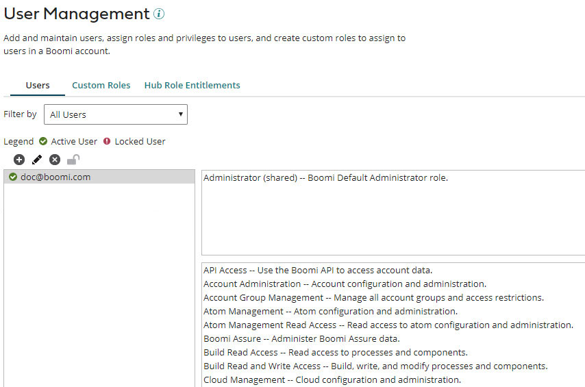

# User Management settings

<head>
  <meta name="guidename" content="Platform"/>
  <meta name="context" content="GUID-523F7364-7372-4E9A-A7A9-B957583A649C"/>
</head>

Use the **User Management** page to add users to a specific Boomi account, assign users specific roles and privileges or create and assign them various custom roles, and unlock SSO users who cannot access the platform. There is a limit of 10000 users that can be linked to a given account; an error will be thrown if this limit is exceeded.

The User Management tab is accessible from the **Settings** page. From the User Management tab, account administrators can assign roles and privileges to account users either giving or limiting their access to various features on the Platform, unlock SSO users who are locked from the platform due to too many invalid API token entries, and manage which users belong to the account. Review the related subtopics to understand more about how to perform User Management actions, and to learn about the various roles, custom roles, and privileges that can be assigned to individual users of the account.

