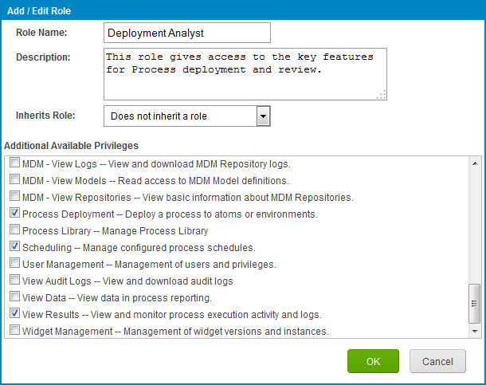

# Adding a custom role

<head>
  <meta name="guidename" content="Platform"/>
  <meta name="context" content="GUID-de2bd23b-ce3a-4db3-9656-cacab756e76e"/>
</head>

Add custom roles in the **Settings** \> **Account Information and Setup** \> **User Management** tab.

## Procedure

1. Select **Settings** \> **Account Information and Setup** and then click the **User Management** tab.

2. On the Custom Roles tab click the **Add** icon.

    The Add/Edit Role dialog opens.

    

3. Enter the role name.

4. (Optional) Enter a description.

5. (Optional) In the **Inherits Role** list, select an existing role.

    This assigns a predefined set of privileges to the custom role.

6. Select additional privileges to apply to the custom role.

7. Click **OK**.

    The custom role is saved and appears on the Custom Roles tab. It also is available in the Add/Maintain User Roles dialog so that you can assign it to users.
    