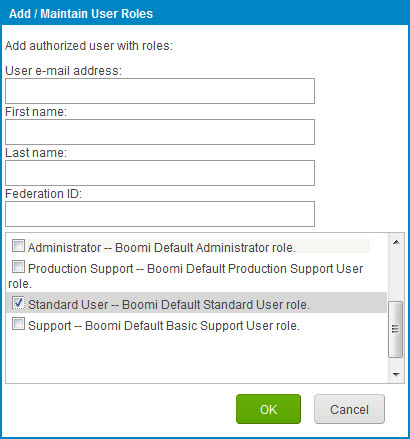

# Adding a single sign-on user and assigning roles

<head>
  <meta name="guidename" content="Platform"/>
  <meta name="context" content="GUID-ea791340-d32a-44f2-a799-c3080357ba2a"/>
</head>

Add single sign-on users and assign roles in the **Settings** \> **Account Information and Setup** \> **User Management** tab.

## About this task

To add a user you must be logged into the account as a user with User Management privileges.

## Procedure

1. Select **Settings** \> **Account Information and Setup** and click the **User Management** tab.

2. On the **Users** tab click the  **Add** icon.

    The Add/Maintain User Roles dialog opens.

    

3. Enter the user's **email address**.

4. Enter the user's **first** and **last names**.

5. Enter the user's **federation ID**. Each user must have a federation ID that uniquely identifies the user within the account. You need this ID to configure the user in your identity provider.

6. Assign the **Standard User** role to the user. Do *not* assign the Administrator role because that gives normal access as well as single sign-on access.

7. Click **OK**.

    The user does *not* receive a welcome notification email containing a password that can be used to log into the Boomi Enterprise Platform account because this password is managed through the identity provider.