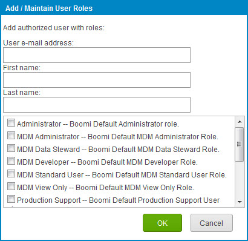

# Adding a user and assigning roles

<head>
  <meta name="guidename" content="Platform"/>
  <meta name="context" content="GUID-d68063f7-2dea-4271-8c0c-6084c4c2226f"/>
</head>

Use the account menu’s **Settings** \> **Account Information and Setup** \> **User Management** tab to add users and assign roles.

## About this task

To add a user you must be logged in as a user with User Management privileges.

## Procedure

1. Select **Settings** \> **Account Information and Setup** and click the **User Management** tab.

2. On the **Users** tab, click the **Add**  icon.

    The Add/Maintain User Roles dialog opens.

    

3. Enter the user's **email address**.

4. Enter the user's **first** and **last names**.

5. Select one or more **roles** to apply to the user.

    Selecting multiple roles increases the number of unique privileges. For standard accounts, Administration and Standard User are the only available roles. To enable a unique set of user privileges, see Managing Custom Roles.

6. Click **OK**.

    New users receive a welcome notification email and temporary password that can be used to log into the account. The user can change their email and/or password on the User Information tab.

    If the user already has access to other accounts through this email address, they receive an email notifying them of access to the new account.
