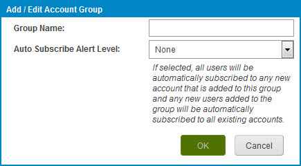

# Adding an account group

<head>
  <meta name="guidename" content="Platform"/>
  <meta name="context" content="GUID-35c1fa9e-473d-4d9e-a50f-057d9b55112d"/>
</head>

Add an account group in the **Settings** \> **Account Information and Setup** \> **Account Groups** tab.

## Procedure

1. Select **Settings** \> **Account Information and Setup** and click the **Account Groups** tab.

2. To the right of the Account Groups list, click the Add icon .

    The Add/Edit Account Group dialog opens.

    

3. Type an account group name.

4. Select a value from the **Auto Subscribe Alert Level** list if you want new and existing users to receive a specific kind of email alert for all accounts within the group.

5. Click **OK**.
