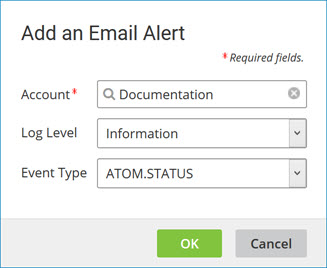

# Adding an email subscription

<head>
  <meta name="guidename" content="Platform"/>
  <meta name="context" content="GUID-7eb61f01-4a5a-4523-9134-776686fbd32e"/>
</head>

Add email subscriptions and specify the appropriate log level and event type on the **Settings** \> **User Information** \> **Email Alerts tab**.

## About this task

The email subscriptions on this tab apply to the user who is logged into the Boomi Enterprise Platform. To configure another user’s email subscriptions you must log in as that user.

## Procedure

1. Select **Settings** \> **User Information**, the **Email Alerts** tab, and the **Integration** tab.

2. Click **Add Email Alert**.

    The Email Alert dialog opens.

3. Click the **Browse** icon.

    The Choose Account dialog opens.

4. Search for an account, select it, and click **OK**.

    

5. In the **Log Level** list, select the type of alerts that you would like to receive.

6. In the **Event Type** list, select type of event for which you would like to receive an alert.

    If you are already subscribed to all event types, you cannot add an individual subscription. First you must remove the All subscription.

    If you are already subscribed to any of the individual event types, you cannot add a subscription to All event types. First you must remove the individual subscription\(s\).

    You cannot subscribe more than once to the same event type.

7. Click **OK**.
