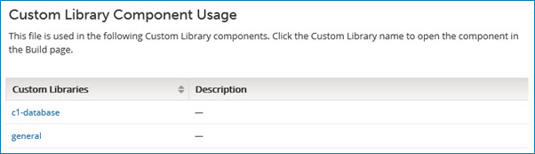

# Displaying components that reference a custom file 

<head>
  <meta name="guidename" content="Platform"/>
  <meta name="context" content="GUID-8f352360-3e3d-46f4-b77c-e1cc6cc52e70"/>
</head>

You can display a list of Custom Library components that reference a given custom JAR file.

## Procedure

1.  On the **Manage Account Libraries** page, select the JAR file whose usage you want to display.

2.  In the ** Actions** menu for the file, select **View Usage in Custom Library Components**.

    The **Custom Library Component Usage** panel is displayed. Custom Library components that reference the JAR file appear in alphabetical order by name.

    

3.  **Optional:** Click a Custom Library component name to open that component in the Build page.