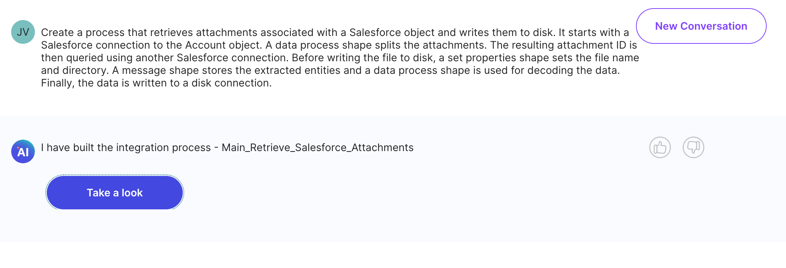

#  Boomi Enterprise Platform

<head>
  <meta name="guidename" content="Release Notes"/>
  <meta name="context" content="GUID-ade439a0-020a-4b8f-b693-f2c9ba503fd7"/>
</head>

**We added these features:**

- All new and existing Boomi AI administrators must agree to the terms and conditions within the Platform user interface before their team can use Boomi GPT. If you are currently using Boomi GPT, an administrator must agree before you can continue your AI conversation.

 Boomi AI administrators can click the AI icon > Get Started to accept the terms and conditions. Read [Getting Started with Boomi GPT](/docs/Atomsphere/Platform/atm-BoomiAI_Getting_Started_5836ede1-84a7-4c32-840b-4a3c4455795b.md) to learn more. (BI-3786)

- The Boomi GPT conversation window now allows up to 750 characters. Text wraps and a scroll bar appears when you type a long sentence. Read [Getting Started with Boomi GPT](/docs/Atomsphere/Platform/atm-BoomiAI_Getting_Started_5836ede1-84a7-4c32-840b-4a3c4455795b.md) to learn more. (BI-3975)

- You can provide feedback about a Boomi GPT response by clicking the thumbs up or thumbs down button. (BI-3086)

- Boomi GPT displays integration suggestions in rows, allowing you to view a larger amount of suggestions. You can click **Show all integrations** to view additional suggestions. (BI-3085)

- We've added new integration suggestions to Boomi GPT for the following connectors: 
  - Salesforce
  - NetSuite
  - Autotask
  - SAP

  (BI-3691)

- We’ve expanded Boomi GPT’s capabilities, allowing you to provide prompts describing your business outcomes and details about your integration. You can include a description of how you want data to flow from one step to the next. This enhancement brings more flexibility to your requests and Boomi GPT’s integration design responses. Boomi GPT also offers suggestions for the best prompts. Read [Creating an Integration Using a Detailed Prompt](/docs/Atomsphere/Platform/atm-BoomiAI_Create_Integration_using_a_Detailed_Prompt.md) to learn more. (BI-3927)

  

- Upgraded the Boomi Enterprise Platform to use Java Corretto version 8u392. (ADSEC-2635)

- The Boomi Key Management Service enhances the security of the Boomi Enterprise Platform and your data. You can use a Boomi-managed or self-managed (on-prem only) KMS to secure passwords and secrets used by connectors. KMS includes:
  - The latest industry-standard key size and encryption algorithms
  - By default, runtimes use a data keys to encrypt and decrypt secrets
  - The ability to use your own HashiCorp Vault (on-prem only)
  - Encryption of environment extensions' secrets by transit

  (ADSEC-2476)

  To learn more about this feature, see the topic [Boomi Key Management Service](../../Integration/Integration%20management/atm-Key_Management_service.md).

- When **New Canvas Experience** is turned on in the Boomi Enterprise Platform settings, a vertical navigation sidebar displays to the left of the Build canvas. You can expand the sidebar to see shortcuts to the Process Library, the Component Explorer, and an option to create a new process. (UU-1861)

**We fixed these issues:**

- When Boomi GPT creates a process with a Try/Catch step, you can now configure the step as expected. (BI-3744)

- After you select your platform account name and **Switch to Another Account** from the Boomi GPT conversation page, you can enter text in the search field to find an account. (BI-3728)

- Boomi GPT no longer presents incorrect autocomplete suggestions when you enter text in the chat window. (BI-3994)

