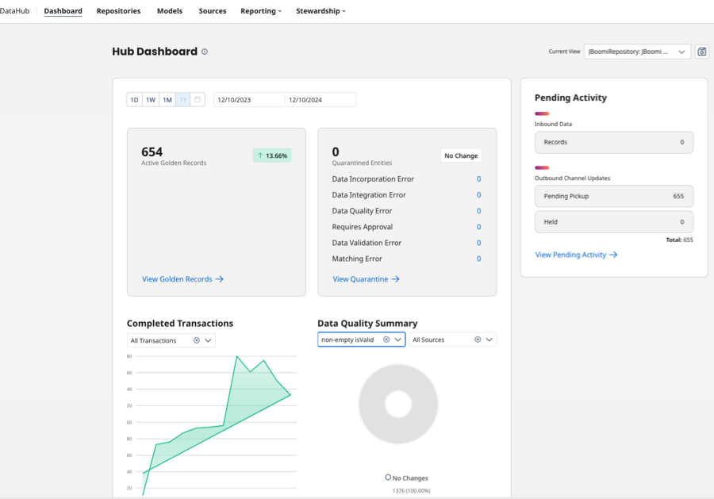

#  Boomi DataHub January 2025 Release Notes

<head>
  <meta name="guidename" content="Release Notes"/>
  <meta name="context" content="GUID-a9a0434d-3fdd-4cda-9912-1bac9b8a02f0"/>
</head>

**We added these features:**

- The new Command Center powered by ServiceNow simplifies data management by providing a dynamic 360-degree visualization of golden records from DataHub storage. The golden record visualization presents metadata in a way that lets business stakeholders gain insights into the data’s context and quality.

  The new golden record view empowers you to collaborate on data management tasks and ensure your data remains reliable and consistent. It boosts data trust, streamlines governance, and accelerates decision-making for improved business outcomes. 
  
  Contact your account representative to activate the Command Center on your platform account. Read [Getting started in Command Center](/docs/Atomsphere/Master%20Data%20Hub/Command_Center/getting_started_in_command_center.md) to learn more. (HUB-4666)

- The DataHub dashboard has a new, modern look with an improved user experience that enhances golden record data visualization and reporting. The dashboard features the following information:
  - **Active golden records** - shows the count of active golden records
  - **Quarantined entities** - shows the count of quarantined entities
  - **Pending activity** - shows counts for incoming source entities, outgoing source record updates, and held source record update requests
  - **Completed transactions** - shows the count of entity transactions that eventually resulted in incorporation, record deletion, or no change to a record
  - **Data quality summary** - shows the count of incoming source entities that Hub sent to data quality steps

  Read [Viewing the Hub dashboard](/docs/Atomsphere/Master%20Data%20Hub/Stewardship/hub-Viewing_the_dashboard.md) to learn more. (HUB-3560)

  

- DataHub shows a warning message anytime you are about to publish a new model version that will delete any of the current published model’s source configurations. The message lists the sources that will be removed if you proceed with publication. You must decide whether to continue or cancel your action. Read [Publishing a model](/docs/Atomsphere/Master%20Data%20Hub/Modeling/t-mdm-Publishing_a_model_eb005b41-9581-4887-8b16-1dbff5069544.md) to learn more. (HUB-2069)

- The Platform API’s Get Repository Summary and Get Repositories Summary endpoints now return the Atom name as an attribute called atomName in the response. Read [Get Repositories Summary](/docs/Atomsphere/Master%20Data%20Hub/REST%20APIs/r-mdm-Get_Repositories_Summary_c51f7f29-7ce6-4550-a7e5-87f32edbcbf1.md) and [Get Repository Summary](/docs/Atomsphere/Master%20Data%20Hub/REST%20APIs/r-mdm-Get_Repository_Summary_75f0ccbb-5d54-4db3-86b5-247b15dc1d1e.md) to learn more. (HUB-5437)

**We fixed these issues:**

- You can now enter and save source entity ID URLS when they contain hash (#) or semi-colon (;) characters. DataHub lets you successfully launch URLs with special characters in any browser. You can access source entity ID URLs by navigating to **Stewardship** > **Golden Records** > **Source** tab in a golden record. (HUB-4597)

- When using the new integration branching feature, MDM components default to the main branch, allowing users to perform actions without disruption. (HUB-4979)

- You can now successfully access historical data at the source level on the Historical Reporting screen. (HUB-4971)

- DataHub displays accurate and detailed quarantine error messages for data quality steps that use an integration process deployed in low latency mode with or without atom workers enabled. (HUB-4911, HUB-3834)

- DataHub now appropriately displays held updates in the user interface with a HELD status. This fix addresses specific scenarios where Hub did not reflect the HELD status for field groups. (HUB-5033)

- Improved the authorized response when using JWT authentication with Repository API endpoints, including the Query Golden Records endpoint. (HUB-5359, HUB-5419)

- When fetching channel updates, Hub no longer sends end-dated collection items in the update request. This issue was caused by HUB-4796, a feature released on December 9, 2024 to improve the performance of the Fetch Channel Updates operation. Patch 25.01.2 resolves the end-dated collection item issue by removing the performance improvements, which will be rescheduled in a future release. The patch 25.01.2 is relevant to public Boomi Hub clouds only. (HUB-5400, HUB-5399)