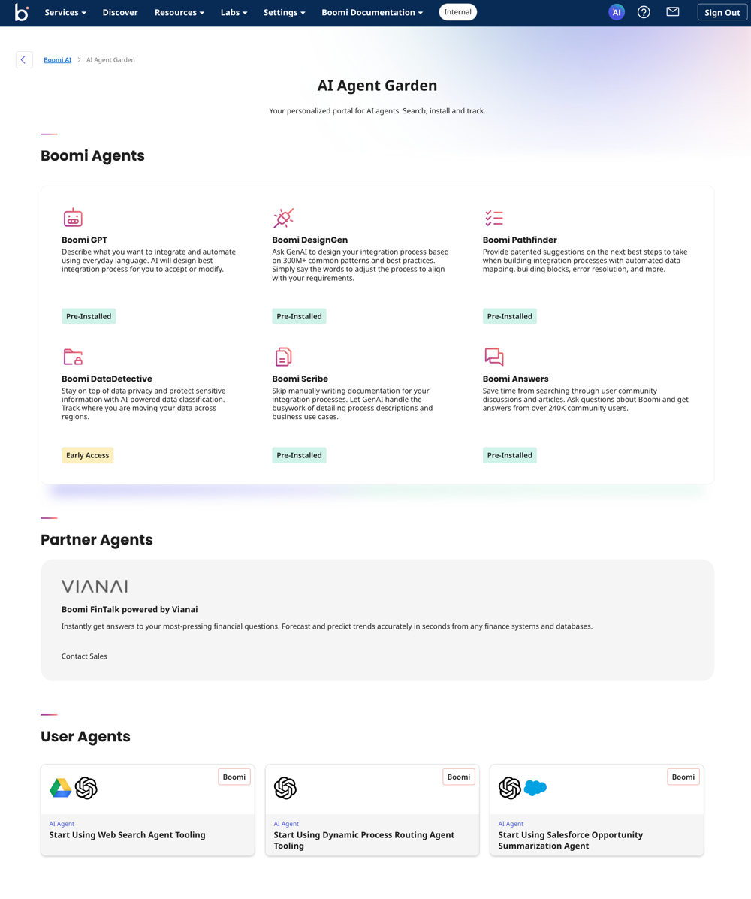
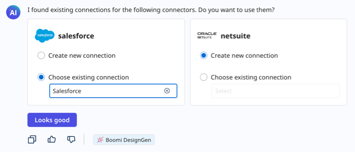

#  Boomi AI

<head>
  <meta name="guidename" content="Release Notes"/>
  <meta name="context" content="GUID-55e46b02-4ecb-4fce-8710-3a4f1566138c"/>
</head>

**The Boomi AI July release introduces [six AI agents](Jul2024_Boomi_AI.md#boomi-ai-agents) and the [AI Agent Garden](Jul2024_Boomi_AI.md#ai-agent-garden), available for all accounts on the Boomi Enterprise Platform. Learn all about our exciting AI release below!**

### <a name="AI-agent-garden">AI Agent Garden</a>

The new AI Agent Garden gives you a high-level view of all the AI agents available in the Boomi Enterprise Platform to meet your integration and automation needs.

AI agents are software components with defined purposes and personalities. They automate tasks using AI-based reasoning to decide and act independently. Some can collaborate to complete complex processes seamlessly. For example, a travel booking agent can coordinate with other AI agents to book a trip, including hotel, car rentals, and flights.

To view the AI Agent Garden, click the AI icon on the platform's Home screen and then click the **AI Agent Garden** link. Read [AI Agent Garden](/docs/Atomsphere/Platform/atm-BoomiAI_Agent_Garden.md) to learn more.

### <a name="Boomi-ai-agents">Boomi AI Agents</a>

We’ve enabled six pre-installed Boomi AI agents for all accounts in the Boomi Enterprise Platform to boost productivity, automate tasks, and streamline business outcomes:

  - [Boomi GPT](/docs/Atomsphere/Platform/atm-BoomiAI_BoomiGPT.md): Enter your prompts in a conversational user interface and Boomi GPT orchestrates Boomi DesignGen, Boomi Answers, and Boomi Scribe to help you achieve your business goals.

  - [Boomi DesignGen](/docs/Atomsphere/Platform/atm-BoomiAI_Boomi_DesignGen.md): Design integration processes with generative AI based on 300M+ patterns and best practices and refine them to fit your requirements.

  - [Boomi Answers](/docs/Atomsphere/Platform/atm-BoomiAI_Boomi_Answers.md): Get quick answers about the Boomi Enterprise Platform using knowledge from Help.Boomi.com and the Boomi Community.

  - [Boomi Scribe](/docs/Atomsphere/Platform/atm-BoomiAI_Boomi_Scribe.md): Let generative AI write documentation for your existing and new integration processes.

  - [Boomi DataDetective](/docs/Atomsphere/Platform/atm-BoomiAI_PII_Insights.md) (Early Access): Protect sensitive information with AI-powered data classification and track data movement across regions.

  - [Boomi Pathfinder](/docs/Atomsphere/Platform/atm-BoomiAI_Boomi_Pathfinder.md): Provide suggestions on the next best steps to take when building integration processes with automated data mapping, building blocks, and more.

  You can also view Partner and User agents in the AI Agent Garden:

  - **Partner agents**: These AI agents are pluggable components from Boomi’s network of partners that offer AI-powered capabilities to elevate your integration and automation efforts.

  - **User agents**: These AI agents are developed by the Boomi Community.

    (BI-5505)

### Boomi GPT

**We added these features:** 

- Boomi GPT orchestrates other Boomi AI agents to meet your automation and integration needs. It adds a tag to its responses to indicate which Boomi AI agent completed your request. (BI-5504)

- The Boomi GPT home page features new prompt examples for Boomi Answers and Boomi Scribe. (BI-4824)

- To ensure optimal service for all users, we have implemented daily AI service request limits for all accounts, which reset at 12:00 AM UTC. As a result, Boomi GPT may display the following error message when the limit is exceeded:
`You have reached our daily limit of messages. Please try again later.` (BI-5699)

- Boomi GPT also displays the following error message when it receives many requests simultaneously:
`Unfortunately, I'm unable to process your request at this time. This happens sometimes as I learn. Please try again.` (BI-5699)

### Boomi DesignGen

**We added these features:**

- Boomi DesignGen now allows you to re-use your connection components in addition to creating new connections when generating an integration. This option is supported when using any integration prompt, including prompts connecting two systems. 

  Boomi DesignGen allows you to choose from up to five available connection components. After you link all the connector components, you can click **Looks good**. Read [Creating an integration using a detailed prompt](/docs/Atomsphere/Platform/atm-BoomiAI_Create_Integration_using_a_Detailed_Prompt.md) to learn more. (BI-5367)

  

- Boomi DesignGen now supports the [IFS REST - Partner connector](/docs/Atomsphere/Integration/Connectors/int-IFS_REST_Connector_e7e1c825-992f-42f8-a41d-f29f8b4992ea.md) when generating integrations. Read [Boomi GPT Supported Connectors](/docs/Atomsphere/Platform/atm-BoomiAI_Connectors_9f8a52e4-5ef2-49ec-bb15-bba51d58fb59.md) to learn more. (BI-5481)

- While generating an integration with DesignGen, you can enter a prompt for Boomi Answers to ask general questions about the Boomi Enterprise Platform and process building unrelated to your generated integration. Once your questions are answered, you can return to the process diagram and click on **Looks good, create the process** to continue generating your integration. (BI-4886)

**We fixed this issue:**

- When your detailed prompt includes a Web Services Server Listener step, Boomi DesignGen includes the Boomi Web Services Server connector as the first step in the generated integration and process diagram. (BI-5126)

### Boomi Scribe

**We added these features:**

- Generated process documentation now contains additional details about mapping functions. It also includes a link that opens the Map component in Integration to provide more context.

  If the integration contains a process call step, the process documentation now provides more context by containing a link to open the subprocess in Integration. Read [Documenting existing integrations](/docs/Atomsphere/Platform/atm-BoomiAI_Create_Documentation_for_Existing_Process.md) to learn more. (BI-5289, BI-5373)

- Connector step descriptions in process documentation now include the following information when available:

  - Operation name
  - Request profile name
  - Response profile name

  (BI-5344)

- We've added error messages to address the following scenarios for Boomi Scribe:
  - We do not support documentation for processes that contain a loop or cycle.
  - When a process is too complex and Scribe cannot generate documentation for it, an error message noting the complexity will display.

  (BI-5814)

**We fixed these issues**

- Generated documentation no longer includes disconnected subprocess steps in the Subprocess Components Count. (BI-5494)

- We enhanced the documentation generation and process diagram rendering to properly handle quotes in the description text for steps in an integration process. (BI-5318)

- Boomi Scribe generates documentation even when the Start step does not contain connector information. (BI-5578)

- Boomi Scribe now allows you to document integrations with curly braces in their component names (such as processes and maps). (BI-5887)

<!-- ### Boomi Answers

**We fixed this issue:**

- We improved the relevancy of community article links provided by Boomi Answers based on your queries. (BI-5375) -->

