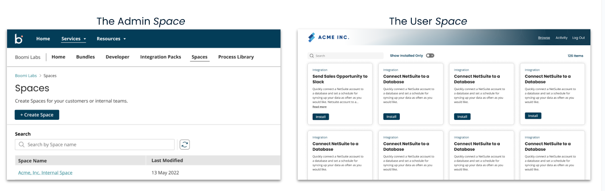

# Getting started with Spaces

<head>
  <meta name="guidename" content="Spaces"/>
  <meta name="context" content="GUID-483fcb89-ef04-449c-b02f-b0dd64692974"/>
</head>

Spaces expand the power of the Boomi Enterprise Platform by creating simplified portals where users can interact with templatized integrations. This capability allows your team or customers to swiftly install and configure integration processes, significantly reducing the time and effort required to manage integrations at scale.

Spaces consist of two primary components: the Admin Space and the User Space. 

The Admin Space empowers developers to curate and deploy integrations. These integrations are pre-built and production-ready, ensuring that they meet quality and reliability standards. 

The User Space is a simplified, self-service portal designed for non-technical users. Here, users can interact with a streamlined version of the Boomi platform, enabling them to schedule, run, monitor processes, and perform light configurations tailored to their specific use cases. This space is designed to minimize the need for IT intervention, allowing business users to meet their integration needs independently. 

Templated integrations, or "hardened templates," standardize the way users utilize the platform. Admins can define the level of control users have within these templates, ensuring a balance between flexibility and governance. This approach allows users to self-serve their integration needs while enabling admins to efficiently manage the platform at a macro level, including security, and data governance.

## Integration packs and Account groups

Spaces rely heavily on Integration Pack technology within the Boomi Enterprise Platform. Integration Packs bundle together multiple process components, configurations, and connectors, making it easier to deploy and manage complex integrations across different teams and environments.

You must ensure the following before performing the Spaces actions.

* **Integration Packs**: Admins must create integration packs, which involve selecting and packaging various integration components. These packs can then be released to managed accounts, allowing for consistent deployment and management. 

  Read [Integration Pack Development](../../Atomsphere/Integration/Integration%20packs/c-atm-Integration_pack_development_1dbd79c2-3cca-4456-aab8-3f8dc37b191a.md) to learn how to create, add/remove packaged components, and release integration packs.
* **Account Groups**: Admins need to create account groups, which involve adding sub-accounts, users, and resources to structured groups. This setup facilitates efficient management and access control across different parts of the organization. 

  Read [Account Group Setting](/docs/Atomsphere/Platform/c-atm-Account_group_management_3997faa4-569c-4092-83ff-b0ff9a3ce161.md) to learn how to create account groups and add sub-accounts, users, and resources.

## Parent-Child account hierarchy

Spaces leverage the Parent-Child Account hierarchy to achieve Platform Multi-tenancy. The platform’s parent-child account hierarchy feature allows you to connect User Space with various child accounts that support functional areas such as sales, marketing, R&D, and finance. Spaces can reflect the enterprise architecture while delivering platform capabilities like reusable shared assets and high availability.

## A sample use case​

Spaces allow central IT or integration teams to facilitate collaboration across different business lines or teams within your company.

Admin Role: Admins via Admin Space create and manage integrations within the Boomi platform. They package these integrations into integration packs and share them within Spaces. For example, an integration pack could include a set of processes for automating order processing, invoicing, and shipment tracking.

User Role: Line of Business (LOB) users from other teams (e.g., sales, marketing) access the User Space. They see only the integration packs shared with them and can install, configure, schedule, and monitor those integrations. For instance, the sales team can use a pre-packaged process to automatically sync CRM data with the ERP system without involving IT.

Admins retain control and manage access, ensuring compliance and security, while LOB users efficiently meet their specific integration needs without needing to log into the platform. 

## Prerequisites​

Before you begin using the Spaces, ensure that you meet the following prerequisites:

* **Valid Login Credentials**: You must have valid login credentials for the [Boomi Enterprise Platform](https://platform.boomi.com/#login). 

* **Access to the Spaces Application**: Ensure you have been granted access to the Spaces application. 

## Accessing Spaces

Once you meet the prerequisites, you can proceed to access the Spaces application:

Log in to [Boomi Enterprise Platform](https://platform.boomi.com/#login) and select **Labs** > **Spaces** in the primary navigation where you can begin managing your Space creation.
