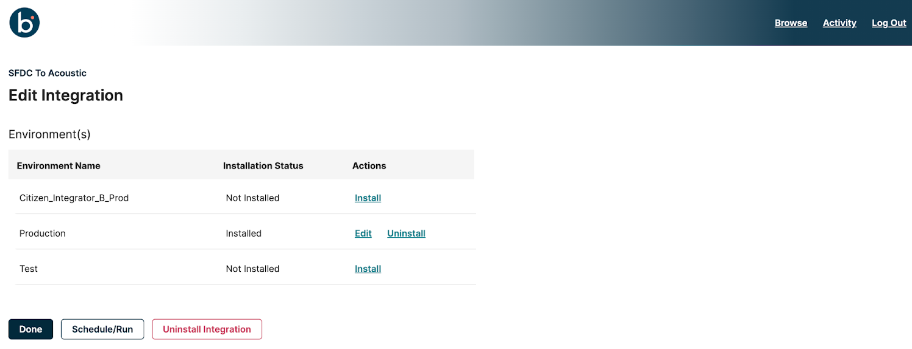

# Edit Integration

<head>
  <meta name="guidename" content="Spaces"/>
  <meta name="context" content="GUID-f9f40222-db53-484d-83c3-447c62db9613"/>
</head>

This page lets you edit the configurations of multi-install integration packs, including Connections, Process properties, and data mappings for the installed environment.

:::note

There is no Edit option for a single installation because, by default, Single-install ipacks are not extensible and do not have any extensible properties.

:::

:::note

  A multi-install integration allows installations across multiple environments but restricts editing to one environment at a time to maintain data integrity and prevent conflicts.

:::

You can perform the following actions on the Edit integration page:

- Edit integration
- Install the integration in a new environment
- Uninstall the integration from a specific environment
- Uninstall the integration from all environments

