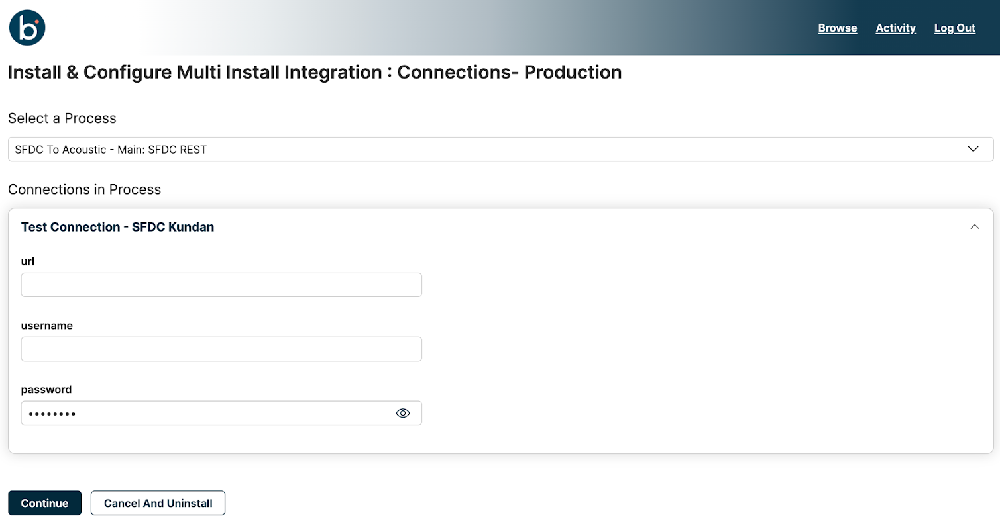
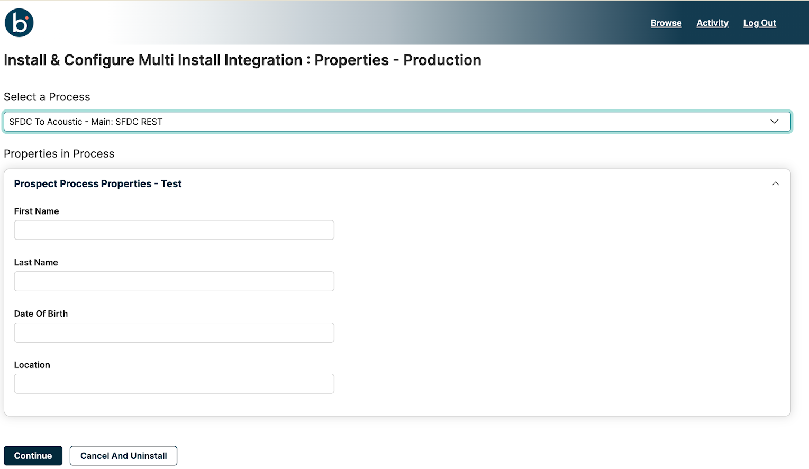
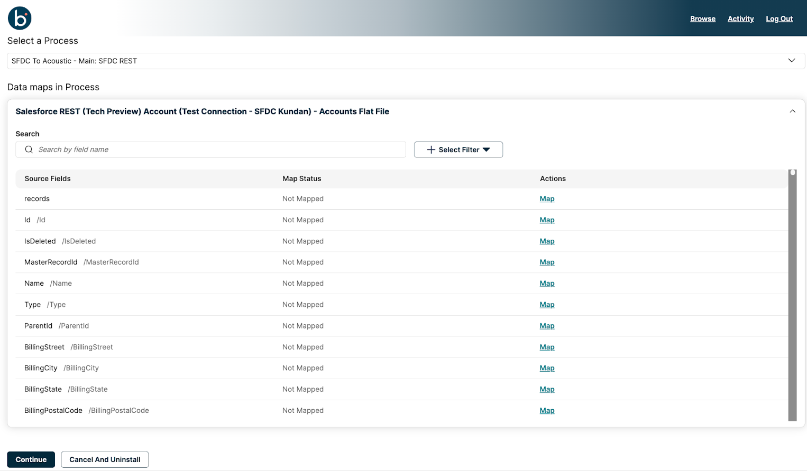

# Installing a Multi Install Integration 

<head>
  <meta name="guidename" content="Spaces"/>
  <meta name="context" content="GUID-f5c63a4f-a454-4d81-8301-d6a800271434"/>
</head>

Multi install integrations are integration packs that allow you to install multiple instances of the Integration per account.

Processes added with any or all of the following extensions can be configured and installed in the Spaces UI.

* Connections
* Process Properties
* Data Maps

Let us explore the installation of an ipack that has all the extensions: Connections, Process properties, and Data maps.

1. In the Spaces User portal, search for the integration you want to install. You can search for an integration by typing its name in the search bar on the Browse page.
2. Click **Install**.
3. Configure the following based on the integration pack configuration set by the Space Admin:
    * **Integration Name** —Type a name for the current instance of the integration.  
    * **Select Environment(s)** — Select a minimum of one or multiple environments to install your integration. 
    * **Use the same configuration in each selected environment** — If you want to use the same configuration in each environment, select **Yes**. Otherwise, select **No**.
:::note

 If you select multiple environments, you must choose whether you want the same or a different configuration in each environment. If you choose **yes**, all the extensible properties will have the same value. If you choose **no**, you can configure different configuration values for the extensible properties for each environment.

:::

4. Click **Continue** to go to the next tab.

5. Select the appropriate process you want to install from the **Select a Process** drop-down list.
6. Configure **Connection** extension values:

    The Connection tab displays the connections of an integration. You can either update the fields associated with a connection to suit your requirement or leave them blank so you can use their default values. For more information, refer to [Connectors](/docs/Atomsphere/Integration/Connectors/c-atm-Connectors_bb305b35-0f13-4937-a918-f85dbbe1b27b.md).

    a. Enter new values for the Connections property fields.

:::note

 Connection property fields will vary depending on the type of connector you have chosen for the Process.

 :::

For the following screenshot example, configure: 

url- URL required to establish the connection.

username- Configure username for your connection.

password- Configure a password for your connection.

     b. Click **Continue** to go to the next page.

:::note

 Configure the connection properties for other environments if you have chosen the radio button to use different configurations in each selected environment during installation.

 :::

7. Configure Process Properties values:

Properties in a process are name/value pairs that store information to assist with your integration.

:::note

 Process property fields vary depending on the configured value during process creation.

 :::

    a. Enter new values for the process property fields.

  Leave any fields blank to use the default value configured by the Space Admin.

    b. Click **Continue** to go to the next page.

    c. Configure the process properties for other environments if you have chosen the radio button to use different configurations in each selected environment during installation.

8. Configure Data Maps extension values.

Data Maps enables you to map additional fields for integration. The admin preconfigures this when creating the process, but you can update or change the mapping configuration according to your requirements. The data Maps table displays the **Source Field**, **Map Status**, and the possible **Actions** for each data.

a. In the search field in the data map table, type the name of the source field you want to map.

b. In the corresponding **Action** column of the source field, click **Map**.

The Map Source Field window opens.

c. Select a target field.
The Apply button is enabled only when you select the map value.

d. Click **Apply**.

:::note

 You can map multiple destination fields to a source field.

 :::

:::note

Functions and user-defined functions are currently not supported in additional field mapping of an integration.

:::

e. Optional: If installing the integration in multiple environments, click **Continue** and repeat all the above steps in other environments.

f. After configuring all environments, click **Done** to finish the installation.

The installation happens with the Process extensions; Connections, Process properties, and data maps and a success message appears if the installation is successful.
