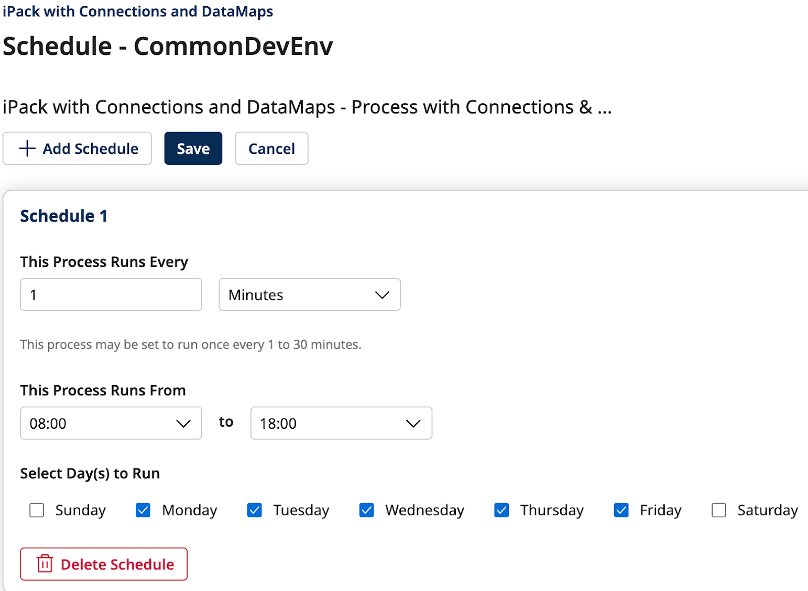

# Scheduling Integration 

<head>
  <meta name="guidename" content="Spaces"/>
  <meta name="context" content="GUID-6e86b57e-588e-47c3-b2c6-b375ff0bb694"/>
</head>

After installing an integration, you can schedule processes within the integration to run at a designated time. It is also possible to add multiple schedules.

    To add a schedule:
    1. Click **Schedule** in the **Action** column.
    2. On the **Schedule Process** > **Data Maps** page, click **Add Schedule** and define the following fields:
        * **This Process Runs Every** -  A time interval for the process to run.
        * **This Process Runs From** -  A start and end time.
        * **Select Day(s) to Run** - Select the days you want this process to run.
    3. Click **Save** to finish.

    Once scheduled, the Schedule status changes from **Not Scheduled** to **Scheduled**.

    To delete a schedule, click **Delete Schedule**.

    You can edit the existing schedule by changing the configured Schedule properties.

