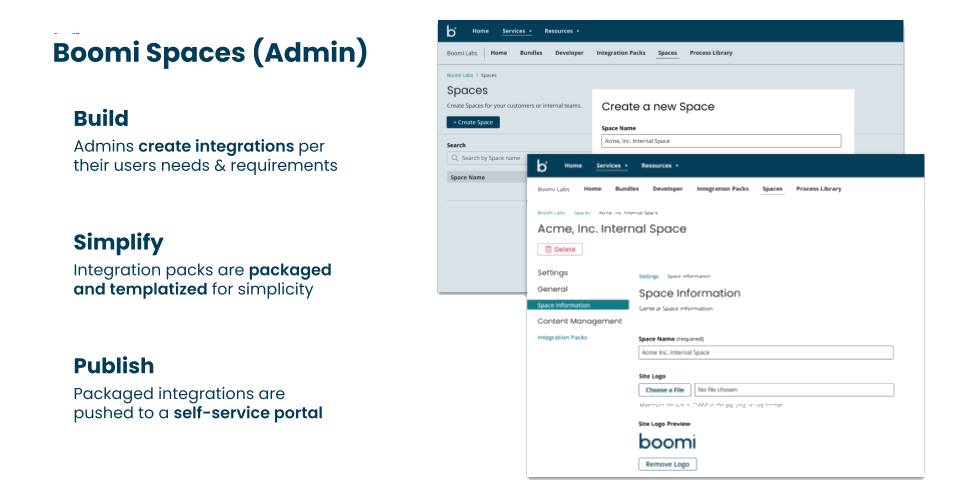
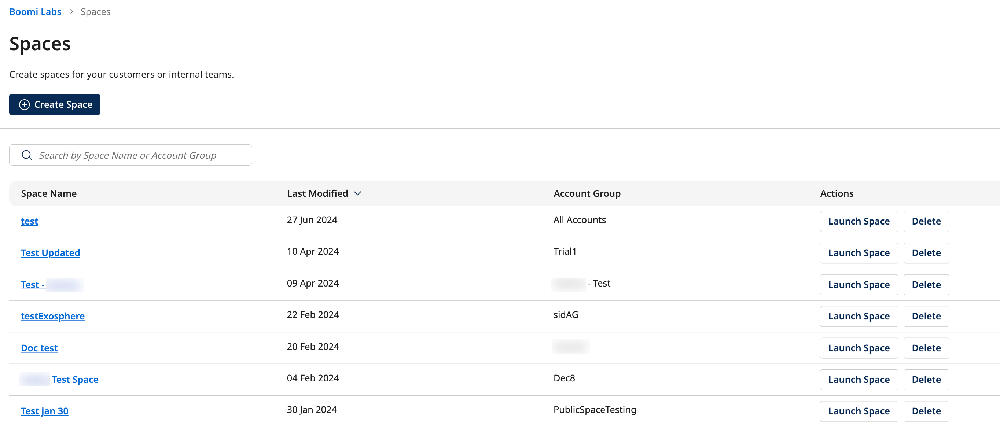

# Administrator Space tasks

<head>
  <meta name="guidename" content="Spaces"/>
  <meta name="context" content="GUID-7da5a286-62a2-11ee-8c99-0242ac120002"/>
</head>

As a Space Administrator, you can create, manage, and deploy integrations tailored to the needs of your users. Your responsibilities include developing integrations, packaging and templating them, and publishing these packages to a self-service portal, where users can easily access and utilize them.

If your account has been granted Spaces admin privileges, you can create a Space in the admin UI for your internal teams or customers. The created Space can be shared with the intended users so that they can install, configure, manage, schedule, and quickly get started with Integrations.

## Admin Home page actions

Using the Spaces Admin Home page, you can create, share, delete, and manage your Spaces. The **Create Space** button on the Home page enables you to create your new Space. For more information on Space creation, refer [Creating a Space](/docs/Atomsphere/Boomi_Labs/Spaces/Getting_started/Admin_Space/Working%20with%20a%20Space/creating_a_space.md).

The main Spaces Admin Home page displays the list of Spaces created by all users of the current account.

The Search bar at the top enables you to search for Spaces using Space Name or Account Group. It searches across all the pages, and the Space table reloads with the search results.

Using the pagination option below the page, you can select the number of items per page to be displayed as 10, 20, or 50 to manage data viewing and to accommodate different user preferences. Alternatively, you can use the **Go to page** option to directly type in the specific page you want to access.

You can view the following information for each Spaces listed on this page. Space Name - The name of the Space.

- Last Modified - Sort the list of Spaces by the Last Modified field. By default, the Spaces list sorts from ascending to descending by the last modified date.

- Account Group -  The Account Group associated with the Space.

- Launch Space- Use the Launch Space button to open the Spaces Consumer UI.

- Delete- Option to delete the Space.

Space Admin can perform the following tasks:

* Create a Space
    * Add a logo to a Space
    * Add Integration Packs to a Space
    * Remove integration packs from a Space
    * Share a Space
* Edit a Space
* Delete a Space
